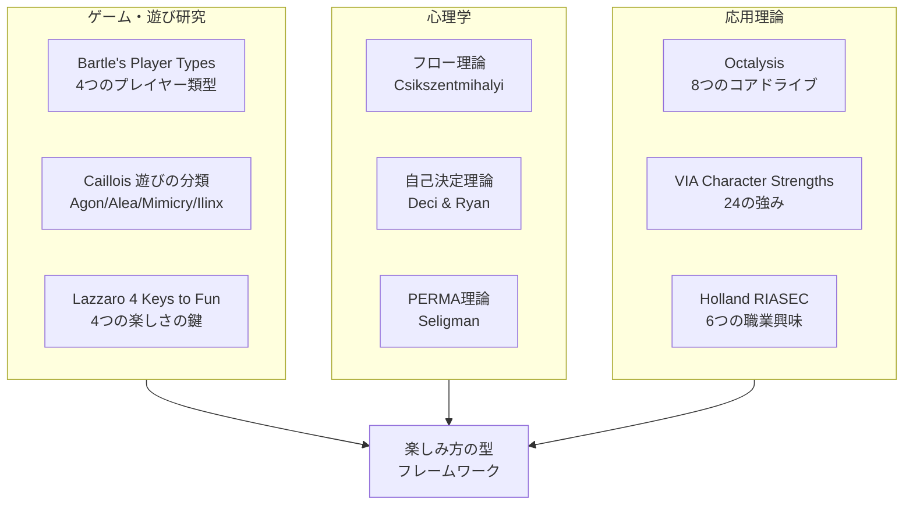
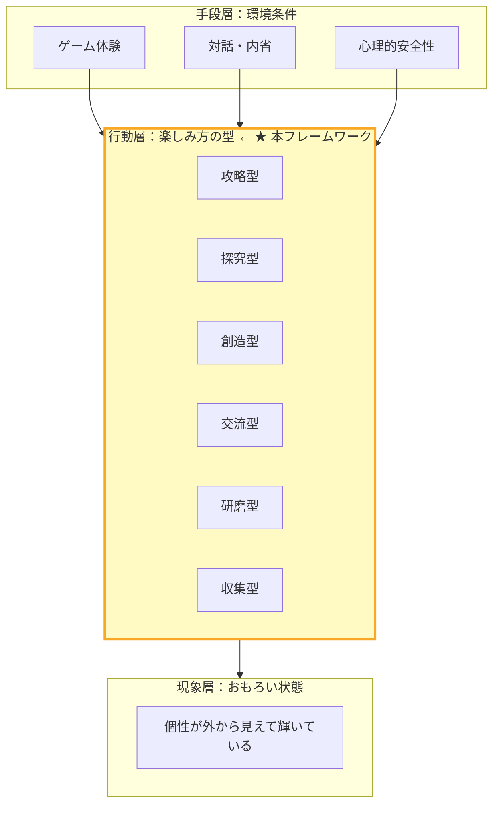
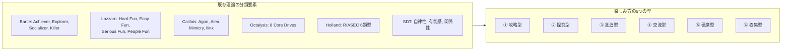
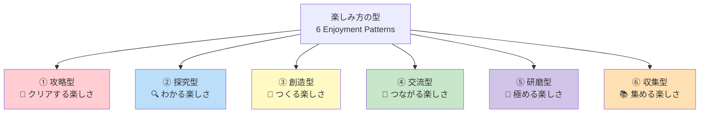
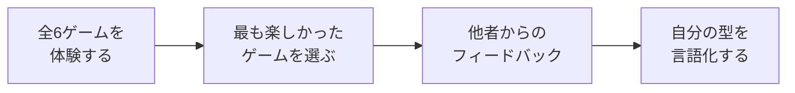
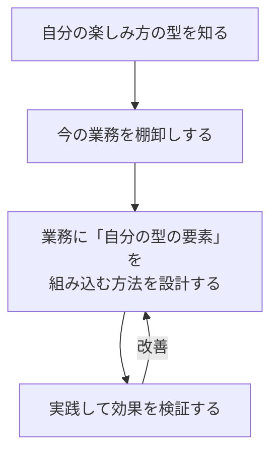
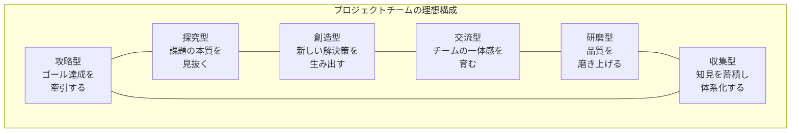
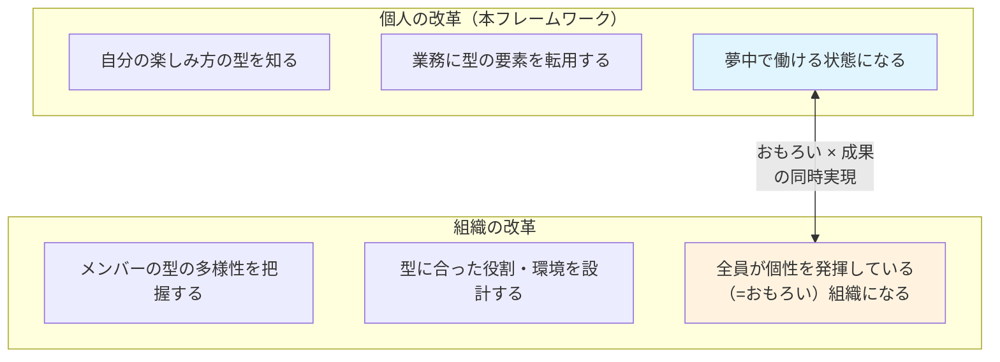
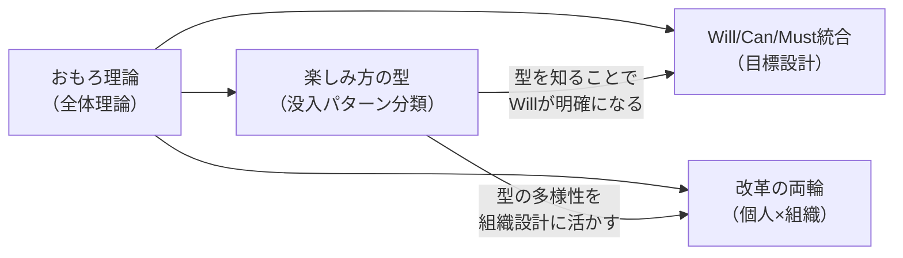

# 楽しみ方の型フレームワーク

**おもろ理論における「没入パターン」のMECE型化**

---

## Executive Summary

本レポートは、Omoro Theory（おもろ理論）の中核概念である「没入パターン」を、**「楽しみ方の型」**として体系化・構造化したものである。

### 本フレームワークの位置づけ

おもろ理論は「個性が外から見えて輝いている状態（＝おもろい）」を没入パターンとして型化し、業務に転用する理論体系である。しかし、**没入パターンそのものの分類・構造化**はこれまで行われていなかった。

本フレームワークは、その空白を埋める。

> **「あなたはどう楽しむ人か？」** という問いを通じて、個人固有の没入パターンを発見するための地図を提供する。

### なぜ「楽しみ方」なのか

「没入行動」「没入パターン」という言葉は正確だが、受講者にとって自分ごとにしにくい。「楽しみ方」と言い換えることで、以下の効果が得られる。

| 視点 | 「没入行動」 | 「楽しみ方」 |
|------|------------|------------|
| **受講者の反応** | 「没入？なんか難しそう」 | 「楽しみ方なら話せる」 |
| **入口** | 仕事の話から始まる | 趣味・遊びの話から始まる |
| **心理的ハードル** | 高い（構える） | 低い（自然に話せる） |
| **自己開示** | 抵抗がある | 好きなことなら喜んで話す |

### 前提：型はグラデーションである

本フレームワークで示す6つの型は、人を固定的に分類するためのものではない。すべての人がすべての型の要素を持っており、**その濃淡が異なる**。型は「あなたはX型の人間です」というラベルではなく、「あなたにはX傾向が強い」という傾向の把握ツールである。

また、型は場面や時期によって変わりうる。仕事では攻略傾向が強い人が、趣味では創造傾向が強いこともある。重要なのは「自分はどの傾向が強いか」を知り、それを業務に活かす手がかりにすることである。

### フレームワークの核心

```
趣味・遊びでの「楽しみ方」を抜き出す
        ↓
  6つの型のうち、自分の傾向を知る
        ↓
  その傾向を仕事に「転用」する
        ↓
  仕事の中で夢中になれる時間が増える
        ↓
  没入状態での業務遂行が増え、生産性の向上が期待できる
```

**例**: 野球が苦手でゲームが好きな子供がいる。この子の楽しみ方の型は「攻略型」である。野球に「1回当てるとレベルアップ」というゲーム的要素を加えると、途端にやる気を出す。この子にとって「レベルが上がる」「ステージをクリアする」という要素が、あらゆる活動を楽しくする鍵なのだ。

これと同じことを、大人の仕事で行う。それが「楽しみ方の型」フレームワークである。

---

## 1. 理論的背景

### 1.1 既存理論の統合

「人はなぜ、何かに夢中になるのか」を説明する理論は、複数の学術分野に分散している。本フレームワークは、これらを統合してMECE分類の根拠とした。



#### 各理論からの借用と発展

| 既存理論 | 借用した概念 | 本フレームワークでの発展 |
|---------|------------|----------------------|
| **Bartle's Player Types** | Achiever/Explorer/Socializer/Killer の4類型 | 4類型を6類型に拡張し、「遊び」だけでなく「仕事」への転用を設計 |
| **Caillois 遊びの分類** | Agon（競争）/Mimicry（模倣・なりきり）という遊びの本質分類 | 「遊びの分類」を「楽しさの源泉」に再定義し、業務行動と接続 |
| **Lazzaro 4 Keys to Fun** | Hard Fun/Easy Fun/Serious Fun/People Fun | 4つの楽しさを6つに再分解し、個人差をより精密に捉える |
| **フロー理論** | 没入状態の発生条件（目標の明確さ、即時フィードバック、挑戦とスキルのバランス） | フロー条件を「型別に異なる」と再定義。型によって没入のトリガーが違う |
| **自己決定理論** | 自律性・有能感・関係性の三欲求 | 三欲求は普遍的だが、どの欲求が最も効くかは「型」で異なると位置づけ |
| **Octalysis** | 8つのコアドライブ（特にDevelopment, Creativity, Social Influence, Ownership） | 8ドライブを6型に再統合し、研修で使いやすい粒度に |
| **VIA Character Strengths** | 好奇心、創造性、チームワーク等の強み分類 | 「強み」ではなく「楽しみ方」として再フレーム。診断依存からの脱却 |
| **Holland RIASEC** | 6つの職業興味タイプ（Realistic/Investigative/Artistic/Social/Enterprising/Conventional） | 職業適性ではなく「楽しみ方」として再定義。仕事の選び方ではなく、今の仕事の楽しみ方を変える |

### 1.2 おもろ理論との接続

本フレームワークは、おもろ理論の3層構造の「行動層」を精緻化するものである。



**従来のおもろ理論**: 「没入パターンを発見し、言語化する」（What）は示したが、「どんなパターンがあるか」（Which）の地図がなかった。

**本フレームワーク**: 「楽しみ方には6つの型がある」という地図を提供することで、受講者が自分の型を発見しやすくなる。

---

## 2. MECE分類の設計

### 2.1 分類軸の選定

「人が夢中になる行動」を分類する方法は複数考えられる。

| 候補の軸 | 説明 | 採用判断 | 理由 |
|---------|------|---------|------|
| **楽しさの源泉**（何があると夢中になるか） | 達成/発見/創造/つながり等 | **採用** | 最も直感的で、受講者が「自分はこれだ」と感じやすい |
| 対象（何に夢中になるか） | タスク/人/アイデア/モノ | 不採用 | 同じ人でも対象は変わる。型として安定しない |
| 環境条件（どんな条件で夢中になるか） | 一人/チーム/時間圧/自由裁量 | 補助軸として活用 | 条件は重要だが、型の「定義」には使いにくい |
| 行動様式（どう夢中になるか） | 深掘り/拡散/最適化 | 一部反映 | 「研磨型」の定義に反映 |

**採用した分類軸：楽しさの源泉**

> 「何があると、その人は夢中になるか？」
>
> つまり、その人にとっての**楽しさのトリガー**は何か。

この軸を選んだ理由：

1. **趣味・遊びから自然に抽出できる** — 「あなたはゲームの何が楽しい？」と聞ける
2. **仕事に転用しやすい** — 「その楽しさを仕事に組み込もう」と設計できる
3. **安定性が高い** — 対象や環境が変わっても、楽しさの源泉は比較的一貫する
4. **既存理論との整合性** — Bartle, Lazzaro, Caillois等の主要理論と対応する

### 2.2 6つの型の導出

既存理論の分類要素を統合し、重複を排除して6つの型に収束させた。



### 2.3 MECE検証

#### 相互排他性の検証

各型は「楽しさの源泉」が異なるため、相互に排他的である。

| 比較ペア | 区別の基準 |
|---------|----------|
| **攻略型 vs 研磨型** | 攻略型は「クリアした瞬間」に快を感じる（結果志向）。研磨型は「品質が上がっていく過程」に快を感じる（過程志向）。判別基準：ゴール達成後に興味を失うなら攻略型、ゴール後も改善を続けたいなら研磨型。 |
| **探究型 vs 収集型** | 探究型は「わかった！」に快を感じる（理解の獲得）。収集型は「揃った！」に快を感じる（完全性の達成）。判別基準：仕組みの理解そのものが目的なら探究型、対象を網羅的に揃えることが目的なら収集型。 |
| **創造型 vs 研磨型** | 創造型は「生み出す」ことが快（ゼロ→イチ）。研磨型は「磨き上げる」ことが快（イチ→百）。判別基準：新しいものを次々作りたいなら創造型、一つのものを徹底的に仕上げたいなら研磨型。 |
| **攻略型 vs 収集型** | 攻略型は「壁を越える」ことが快（困難の克服）。収集型は「集める・揃える」ことが快（蓄積と完成）。判別基準：目標達成後にコレクションに興味がなくなるなら攻略型、集めたもの自体を眺めて満足するなら収集型。 |
| **交流型 vs 他の5型** | 交流型は「人とのつながり」が快の源泉。他の5型は「活動そのもの」が快の源泉。判別基準：一人でやると楽しさが半減するなら交流型。 |
| **探究型 vs 創造型** | 探究型は「既にあるものを理解する」が快（インプット志向）。創造型は「新しいものを作る」が快（アウトプット志向）。判別基準：「なるほど」が快感なら探究型、「できた」が快感なら創造型。 |

#### 網羅性の検証

主要理論の分類要素がすべてカバーされているかを検証する。

| 既存理論の要素 | 対応する型 | カバー状況 |
|--------------|----------|----------|
| Bartle: Achiever | ① 攻略型 | ✅ |
| Bartle: Explorer | ② 探究型 | ✅ |
| Bartle: Socializer | ④ 交流型 | ✅ |
| Bartle: Killer | ① 攻略型（競争的達成） | ✅ |
| Lazzaro: Hard Fun | ① 攻略型 | ✅ |
| Lazzaro: Easy Fun | ② 探究型 | ✅ |
| Lazzaro: People Fun | ④ 交流型 | ✅ |
| Lazzaro: Serious Fun | （後述：スコープ外） | — |
| Caillois: Agon（競争） | ① 攻略型 | ✅ |
| Caillois: Mimicry（模倣・なりきり） | ③ 創造型（表現的側面と関連） | ✅（部分的） |
| Caillois: Alea（偶然） | （後述：スコープ外） | — |
| Caillois: Ilinx（眩暈） | （後述：スコープ外） | — |
| Octalysis: Development & Accomplishment | ① 攻略型 | ✅ |
| Octalysis: Empowerment of Creativity | ③ 創造型 | ✅ |
| Octalysis: Social Influence | ④ 交流型 | ✅ |
| Octalysis: Ownership & Possession | ⑥ 収集型 | ✅ |
| Octalysis: Unpredictability & Curiosity | ② 探究型 | ✅ |
| Octalysis: Epic Meaning & Calling | （後述：スコープ外） | — |

#### 本フレームワークのスコープ外とした要素

以下の要素は、6つの型では直接カバーしていない。学術的誠実性のため、その理由を明記する。

| 要素 | スコープ外とした理由 |
|------|---------------------|
| **Caillois: Alea（偶然・運）** | ギャンブルや宝くじのような「偶然に賭ける楽しさ」は、業務への転用が困難であり、本フレームワークの目的（仕事での再現可能な没入）と合致しないため |
| **Caillois: Ilinx（眩暈・スリル）** | ジェットコースター的な「感覚の撹乱への快」は、業務場面で再現・活用する設計が非現実的なため |
| **Lazzaro: Serious Fun** | 「活動を通じて現実に意味のある変化を起こす楽しさ」は、特定の型ではなく、すべての型が「業務転用」された時に生まれる楽しさと位置づけられるため |
| **Octalysis: Epic Meaning & Calling** | 「崇高な使命感による動機」は独立した動機であり、6型のいずれかに還元するより、おもろ理論のWill/Can/Must統合フレームワークの「Will」として扱うほうが適切なため |

**結論: 6つの型は、業務で再現可能な楽しみ方の主要パターンを実用的な精度でカバーしている。ただし人間の楽しみ方のすべてを網羅するものではなく、あくまで「趣味・遊びの楽しみ方を仕事に転用する」という目的に最適化された実践的分類である。**

#### Holland RIASECとの参考的な対応関係

Holland RIASECは「職業興味」の分類であり、「楽しみ方」の分類ではないため、1対1の対応ではなく、傾向としての関連を示す。

| Holland類型 | 関連が強い型 | 関連の性質 |
|------------|------------|----------|
| Realistic（実践型） | 研磨型 | 具体的な対象と向き合う志向が共通 |
| Investigative（研究型） | 探究型 | 知的好奇心と分析志向が共通 |
| Artistic（芸術型） | 創造型 | 自己表現と創造への志向が共通 |
| Social（社会型） | 交流型 | 対人関係とつながりへの志向が共通 |
| Enterprising（企業型） | 攻略型 | 目標達成と影響力への志向が共通 |
| Conventional（慣習型） | 収集型 | 体系的な整理と構造化への志向が共通 |

> **注意**: これらは傾向的な関連であり、例えばRealistic型の人が必ずしも研磨型とは限らない。Holland理論は「何の仕事を選ぶか」の指標であり、本フレームワークは「今の仕事をどう楽しむか」の指標である点が根本的に異なる。

---

## 3. 楽しみ方の6つの型

### 3.0 全体像



### 3.1 ① 攻略型 — 「クリアする」楽しさ

> **定義**: 明確な目標や困難な壁が存在し、それを戦略的に乗り越えて達成する瞬間に最大の快を感じる型。

#### プロファイル

| 項目 | 内容 |
|------|------|
| **楽しさの源泉** | 壁を越える・ゴールを達成する・レベルが上がる |
| **快のピーク** | クリアした瞬間、勝った瞬間、目標を達成した瞬間 |
| **没入のトリガー** | 明確なゴール設定、適度な難易度、進捗の可視化 |
| **キーワード** | 達成、攻略、クリア、レベルアップ、勝利、突破 |

#### 趣味・遊びでの典型例

- ゲームのボス戦を攻略する、ステージをクリアする
- マラソンの完走、タイムの更新
- 資格試験への挑戦と合格
- 登山で山頂に到達する
- ゴルフのスコア更新、ベストスコアへの挑戦
- DIYでの「完成」を目指すプロジェクト（棚を作る、庭を完成させる）

#### この型の人の行動特徴

| 場面 | 行動 |
|------|------|
| **ゲームで** | 攻略情報を調べ、戦略を立て、ボスを倒すまでやめない |
| **趣味で** | 記録や目標を設定し、それを超えることに燃える |
| **学びで** | 資格取得、スコア向上など「達成の証」を求める |
| **退屈を感じる時** | ゴールが不明確、手応えがない、簡単すぎる |

#### フロー条件との関係

```
攻略型のフロー条件
├── 明確なゴール ............ ★★★（最重要）
├── 即時フィードバック ...... ★★★（進捗が見える）
├── 挑戦とスキルのバランス .. ★★★（適度に難しい）
└── 自律性 .................. ★★☆（攻略の自由度）
```

#### 仕事への転用設計

| 転用の原則 | 具体的な方法 |
|-----------|-------------|
| **ゴールを明確にする** | 業務目標を「ステージ制」に分解する。月次KPIを「ボス戦」に見立てる |
| **進捗を可視化する** | 達成度をレベルやスコアで表示する。チェックリストで「クリア感」を演出 |
| **適度な難易度を設定する** | 現在のスキルの少し上の課題を設定する。簡単すぎると退屈、難しすぎると諦める |
| **達成を承認する** | 目標達成時に明確な「クリア演出」を入れる。振り返りで「どの壁を越えたか」を言語化 |

#### 学術的根拠

| 理論 | 接続ポイント |
|------|------------|
| **フロー理論** | 挑戦とスキルのバランスが没入を生む（Csikszentmihalyi, 1990） |
| **目標設定理論** | 困難で具体的な目標が高いパフォーマンスを導く（Locke & Latham, 1990） |
| **自己決定理論** | 有能感（Competence）の充足が内発的動機を高める（Deci & Ryan, 2000） |
| **Bartle Player Types** | Achiever型：ゲーム内目標の達成に動機づけられる（Bartle, 1996） |

---

### 3.2 ② 探究型 — 「わかる」楽しさ

> **定義**: 未知の領域を探り、新しい知識や法則を発見し、「なるほど、そういうことか！」と腑に落ちる瞬間に最大の快を感じる型。

#### プロファイル

| 項目 | 内容 |
|------|------|
| **楽しさの源泉** | 知らないことを知る・仕組みを解明する・法則を見つける |
| **快のピーク** | 「わかった！」の瞬間、点と点がつながる瞬間 |
| **没入のトリガー** | 未知の対象、「なぜ？」という問い、自由な探索 |
| **キーワード** | 発見、理解、解明、好奇心、「なるほど」、深掘り |

#### 趣味・遊びでの典型例

- 知らない街を地図なしで歩く
- Wikipedia を延々と読み続ける
- 旅行先で地元の文化や歴史を深掘りする
- 新しいジャンルの本や記事を読みあさる
- ワインや日本酒の産地・製法を調べ始めて止まらない
- 子供の「なぜ？」に一緒に調べて答えるのが楽しい

#### この型の人の行動特徴

| 場面 | 行動 |
|------|------|
| **ゲームで** | 攻略よりも世界観の探索を優先。隠し要素を見つけることに喜ぶ |
| **趣味で** | 「なぜこうなるのか？」を調べ始めると止まらない |
| **学びで** | カリキュラムより自分の興味に従って学ぶ。脱線を楽しむ |
| **退屈を感じる時** | 答えが決まっている作業、マニュアル通りの反復 |

#### フロー条件との関係

```
探究型のフロー条件
├── 未知の対象 .............. ★★★（最重要）
├── 探索の自由度 ............ ★★★（自分で調べられる）
├── 発見のフィードバック .... ★★☆（わかった瞬間の手応え）
└── 挑戦とスキルのバランス .. ★★☆（理解の難易度）
```

#### 仕事への転用設計

| 転用の原則 | 具体的な方法 |
|-----------|-------------|
| **「なぜ？」を業務に埋め込む** | 定型業務に「なぜこのプロセスなのか？」を問う時間を設ける |
| **探索の余白を作る** | 業務時間の一部を「自由研究タイム」に充てる。Google式20%ルールの小規模版 |
| **発見を共有する場を用意する** | 「今週見つけたこと」を共有する朝会。発見を言語化する機会 |
| **データをクエストにする** | 業務データの中に「法則を見つける」ミッションを設計する |

#### 学術的根拠

| 理論 | 接続ポイント |
|------|------------|
| **フロー理論** | 好奇心によるオートテリック（自己目的的）な体験（Csikszentmihalyi, 1990） |
| **自己決定理論** | 自律性（Autonomy）の充足が探索行動を促進（Deci & Ryan, 2000） |
| **Bartle Player Types** | Explorer型：ゲーム世界の仕組みの発見に動機づけられる（Bartle, 1996） |
| **VIA Character Strengths** | 好奇心（Curiosity）は最もフローと相関が高い強みの一つ（Peterson & Seligman, 2004） |

---

### 3.3 ③ 創造型 — 「つくる」楽しさ

> **定義**: 自分のアイデアや感性を形にし、何かを生み出すプロセスに最大の快を感じる型。

#### プロファイル

| 項目 | 内容 |
|------|------|
| **楽しさの源泉** | 何かを生み出す・アイデアを形にする・自分を表現する |
| **快のピーク** | 「これ、自分が作ったんだ」と実感する瞬間 |
| **没入のトリガー** | 自由な裁量、表現の余地、制約の中の工夫 |
| **キーワード** | 創る、表現、アイデア、デザイン、工夫、オリジナル |

#### 趣味・遊びでの典型例

- 料理でオリジナルレシピを考案する、アレンジを加える
- DIY・日曜大工で棚やテーブルを自作する
- 絵を描く、音楽を演奏・作曲する
- 写真撮影で構図やレタッチにこだわる
- ブログや動画でコンテンツを発信する
- インテリアを自分好みにコーディネートする
- 子供の誕生日パーティーの企画・演出を凝る

#### この型の人の行動特徴

| 場面 | 行動 |
|------|------|
| **ゲームで** | 自由度の高いクリエイティブモードを好む。攻略よりも作ることが目的 |
| **趣味で** | 既存のものを自分なりにアレンジする。「自分ならこうする」を考える |
| **学びで** | 聞くだけの座学は退屈。手を動かして何かを作るワークが好き |
| **退屈を感じる時** | 完全にマニュアル化された作業、自分の裁量がゼロの仕事 |

#### フロー条件との関係

```
創造型のフロー条件
├── 表現の自由度 ............ ★★★（最重要）
├── 具現化の手段 ............ ★★★（形にできるツール・素材）
├── フィードバック .......... ★★☆（作品への反応）
└── 制約の存在 .............. ★★☆（制約があるほうが創造性が出る）
```

#### 仕事への転用設計

| 転用の原則 | 具体的な方法 |
|-----------|-------------|
| **アウトプットに「作品感」を持たせる** | 報告書を「自分の作品」として仕上げる。テンプレに+αの工夫を入れる余地を与える |
| **裁量を確保する** | 「やり方」は任せる。ゴールだけ示して、プロセスは自由に |
| **作ったものを見せる場を用意する** | 成果物の発表会、社内展示。フィードバックを受ける機会 |
| **制約を「お題」にする** | 予算・時間の制約を「この条件で最高のものを作るゲーム」にリフレーム |

#### 学術的根拠

| 理論 | 接続ポイント |
|------|------------|
| **フロー理論** | Csikszentmihalyi（1996）は創造的な人物が頻繁にフロー状態を報告することを示した |
| **自己決定理論** | 自律性（Autonomy）の充足が創造性を最大化する（Deci & Ryan, 2000） |
| **Caillois** | Mimicry（模倣・なりきり）：模倣・なりきりの延長線上にある創造的表現と接続する（Caillois, 1958） |
| **Octalysis** | Core Drive #3: Empowerment of Creativity & Feedback（Yu-kai Chou, 2014） |

---

### 3.4 ④ 交流型 — 「つながる」楽しさ

> **定義**: 人と関わり、一緒に楽しみ、誰かの役に立ったり、チームで何かを成し遂げることに最大の快を感じる型。

#### プロファイル

| 項目 | 内容 |
|------|------|
| **楽しさの源泉** | 人とつながる・一緒に楽しむ・誰かに貢献する |
| **快のピーク** | 「この人たちと一緒だから楽しい」「ありがとう」と言われた瞬間 |
| **没入のトリガー** | 仲間の存在、チームの一体感、誰かからの感謝 |
| **キーワード** | 仲間、共有、一体感、感謝、盛り上がる、一緒に |

#### 趣味・遊びでの典型例

- チームスポーツ（フットサル、草野球、ゴルフのコンペ等）
- BBQ、飲み会、ボードゲーム会の幹事
- 地域の父親コミュニティ、PTAの仲間との活動
- SNSでの交流、趣味のコミュニティ運営
- 後輩・部下の成長を見守る、メンター的な関わり
- フェスやライブで一体感を味わう

#### この型の人の行動特徴

| 場面 | 行動 |
|------|------|
| **ゲームで** | ソロプレイよりマルチプレイ。一人でやると途中でやめがち |
| **趣味で** | 一人でやるより誰かと一緒にやりたい。体験を共有したい |
| **学びで** | グループワーク、ディスカッションが好き。一人で黙々は苦手 |
| **退屈を感じる時** | 一人で黙々と作業する時間が長い、人との関わりがない |

#### フロー条件との関係

```
交流型のフロー条件
├── 仲間の存在 .............. ★★★（最重要）
├── 共通の目標・体験 ........ ★★★（一緒に目指すもの）
├── 相互のフィードバック .... ★★☆（リアクション・感謝）
└── 心理的安全性 ............ ★★★（安心して関われる）
```

#### 仕事への転用設計

| 転用の原則 | 具体的な方法 |
|-----------|-------------|
| **チームの一体感を設計する** | プロジェクトに「チーム名」をつける。共通の目標を「合言葉」にする |
| **感謝を可視化する** | 「ありがとうカード」制度、ピアボーナス。貢献が見える仕組み |
| **一緒にやる時間を増やす** | ペアワーク、モブプログラミング、共同作業タイム |
| **共有の場を設ける** | 週次の振り返りミーティング、成果の共有会。一人で完結させない |

#### 学術的根拠

| 理論 | 接続ポイント |
|------|------------|
| **自己決定理論** | 関係性（Relatedness）の充足が内発的動機を高める（Deci & Ryan, 2000） |
| **Bartle Player Types** | Socializer型：他プレイヤーとの交流が動機（Bartle, 1996） |
| **Lazzaro 4 Keys** | People Fun：社会的交流から生まれる楽しさ（Lazzaro, 2004） |
| **PERMA理論** | Relationships（関係性）がウェルビーイングの構成要素（Seligman, 2011） |

---

### 3.5 ⑤ 研磨型 — 「極める」楽しさ

> **定義**: 一つの対象に向き合い、技術や品質を磨き上げ、完成度を高めていくプロセスそのものに最大の快を感じる型。
>
> **なぜ「没頭型」ではないのか**: 「没頭」はすべての型で起きうる状態である。攻略型の人もゲームに没頭するし、探究型の人も調査に没頭する。本型の本質は「没頭すること」ではなく「品質・精度の向上そのものが快の源泉」であることにあるため、「研磨型」と命名した。

#### プロファイル

| 項目 | 内容 |
|------|------|
| **楽しさの源泉** | 一つのことを深く追求する・技を磨く・完成度を高める |
| **快のピーク** | 「昨日より上手くなった」「ここまで仕上がった」と実感する瞬間 |
| **没入のトリガー** | 集中できる環境、中断されない時間、深掘りできる対象 |
| **キーワード** | 匠、職人、極める、磨く、こだわり、精度、深化 |

#### 趣味・遊びでの典型例

- 釣り（仕掛け・ポイント・タイミングを極める）
- ゴルフのスイングフォームを徹底的に改善する
- 楽器の練習（一つのフレーズを納得いくまで繰り返す）
- 筋トレ（フォームの精度と記録の向上を追求する）
- 車やバイクのメンテナンスを自分で行い、仕上がりにこだわる
- 盆栽や庭の手入れ、家庭菜園での土づくり

#### この型の人の行動特徴

| 場面 | 行動 |
|------|------|
| **ゲームで** | やり込み要素を極める。効率よりも完璧を求める |
| **趣味で** | 「もうちょっと」が永遠に続く。納得いくまでやめない |
| **学びで** | 広く浅くより狭く深く。一つのテーマを徹底的に深掘りする |
| **退屈を感じる時** | 中途半端な品質で終わらされる、集中が中断される |

#### フロー条件との関係

```
研磨型のフロー条件
├── 集中できる環境 .......... ★★★（最重要）
├── 中断されない時間 ........ ★★★（まとまった時間が必須）
├── 段階的な改善実感 ........ ★★☆（微細な上達の手応え）
└── こだわれる余地 .......... ★★★（品質の追求が許される）
```

#### 仕事への転用設計

| 転用の原則 | 具体的な方法 |
|-----------|-------------|
| **集中時間を守る** | 「ディープワークタイム」を設定。会議やチャットの通知をオフにする時間帯を作る |
| **品質追求を評価する** | 速さだけでなく「仕上がりの質」を評価項目に。こだわりを価値として認める |
| **専門領域を持たせる** | 「この分野ならこの人」というポジションを明確にする |
| **改善の余地を残す** | 「完成」で終わらず「さらに良くできるか？」を問い続ける仕組み |

#### 学術的根拠

| 理論 | 接続ポイント |
|------|------------|
| **フロー理論** | フロー体験の中核。活動そのものが報酬となるオートテリック体験（Csikszentmihalyi, 1990） |
| **マスタリー目標志向** | 成績目標よりマスタリー目標が持続的動機に繋がる（Dweck, 1986） |
| **意図的練習** | 限界領域での反復練習が熟達を生む（Ericsson, 1993） |
| **ジョブ・クラフティング** | タスク境界の変更：品質追求のために業務の範囲や方法を自ら再設計する（Wrzesniewski & Dutton, 2001） |

---

### 3.6 ⑥ 収集型 — 「集める・揃える」楽しさ

> **定義**: 対象を集め、整理し、コレクションを完成させることに最大の快を感じる型。蓄積と完全性の追求がドライバーとなる。

#### プロファイル

| 項目 | 内容 |
|------|------|
| **楽しさの源泉** | 集める・揃える・コンプリートする・体系化する |
| **快のピーク** | 「全部揃った！」「きれいに整理できた」と達成感を得る瞬間 |
| **没入のトリガー** | コレクション対象の存在、進捗の可視化、完全性への挑戦 |
| **キーワード** | 収集、コンプリート、図鑑、整理、分類、カタログ、制覇 |

#### 趣味・遊びでの典型例

- 御朱印集め、スタンプラリー、道の駅巡り
- ワインや日本酒のラベルコレクション、飲んだ銘柄リスト
- 47都道府県制覇、全国の名城・名湯巡り
- レコード・スニーカー・腕時計のコレクション
- 写真アルバムの整理、旅行記録のデータベース化
- 読んだ本のリストを完璧に管理する

#### この型の人の行動特徴

| 場面 | 行動 |
|------|------|
| **ゲームで** | メインストーリーよりもサブクエスト全制覇。実績トロフィー100%を目指す |
| **趣味で** | 「あと○個で全部揃う」状態に燃える。リストを作って消していくのが快感 |
| **学びで** | 体系的に整理されたカリキュラムを好む。全体像の中の現在地を知りたい |
| **退屈を感じる時** | 蓄積が見えない、終わりのない作業、集めたものが散逸する |

#### フロー条件との関係

```
収集型のフロー条件
├── コンプリート可能な対象 .. ★★★（最重要）
├── 進捗の可視化 ............ ★★★（何/何まで集まったか）
├── 分類・整理の余地 ........ ★★☆（自分なりの体系化）
└── 希少性 .................. ★★☆（レアなものほど燃える）
```

#### 仕事への転用設計

| 転用の原則 | 具体的な方法 |
|-----------|-------------|
| **業務をコレクション化する** | 「取引先100社制覇」「スキルバッジ20個獲得」のようにコンプリート要素を設計 |
| **進捗を可視化する** | 「あと○件で目標達成」のカウンター。ビジュアルで埋まっていく進捗表 |
| **蓄積を価値にする** | ナレッジベースの構築、事例データベースの充実を成果として認める |
| **整理する楽しさを活かす** | 業務プロセスの体系化、マニュアル整備を「コレクション」として任せる |

#### 学術的根拠

| 理論 | 接続ポイント |
|------|------------|
| **Octalysis** | Core Drive #4: Ownership & Possession。所有と蓄積への動機（Yu-kai Chou, 2014） |
| **目標勾配効果** | ゴールに近づくほどモチベーションが高まる（Hull, 1932; Kivetz et al., 2006） |
| **Holland RIASEC** | Conventional型：体系的な整理と構造化への志向（Holland, 1997） |
| **Zeigarnik効果** | 未完了のタスクは完了タスクより記憶に残り、完成への動機を生む（Zeigarnik, 1927） |

---

## 4. 型の発見方法

### 4.1 セルフチェックシート（レーダーチャート型）

以下の18の場面に対して、「自分はどれくらい共感できるか」を5段階で評価する。型は「あなたはX型」と断定するものではなく、6つの傾向の濃淡を可視化するためのツールである。

#### Step 1: 場面への共感度を評価する（1=全く共感しない 〜 5=とても共感する）

**攻略傾向**
| # | 場面 | 共感度(1-5) |
|---|------|-----------|
| A1 | 締切が厳しいプロジェクトを何とかやり遂げた瞬間が最高に気持ちいい | |
| A2 | ゲームやスポーツで「勝った！」「クリアした！」と感じる瞬間のために頑張れる | |
| A3 | 目標を数値で設定し、それを達成していくのが好きだ | |

**探究傾向**
| # | 場面 | 共感度(1-5) |
|---|------|-----------|
| B1 | 「なぜこうなるのか？」を調べ始めると止まらなくなる | |
| B2 | 旅行先では有名スポットより、地元の人しか知らない場所を見つけたい | |
| B3 | バラバラだった情報が一つにつながった瞬間が最高に気持ちいい | |

**創造傾向**
| # | 場面 | 共感度(1-5) |
|---|------|-----------|
| C1 | 料理やDIYで「自分なりのアレンジ」を加えるのが楽しい | |
| C2 | テンプレート通りにやるより、自分のやり方で仕上げたい | |
| C3 | 「これ、自分が作ったんだ」と思える瞬間がたまらない | |

**交流傾向**
| # | 場面 | 共感度(1-5) |
|---|------|-----------|
| D1 | 一人でやるより誰かと一緒にやるほうが断然楽しい | |
| D2 | 「ありがとう」と言われると、何よりもやる気が出る | |
| D3 | 飲み会やイベントの幹事をするのが苦にならない（むしろ好き） | |

**研磨傾向**
| # | 場面 | 共感度(1-5) |
|---|------|-----------|
| E1 | 一つのことを納得いくまで追求し、品質を高めるのが好きだ | |
| E2 | 「もうちょっと良くできるはず」と思うと、やめられない | |
| E3 | 中途半端な仕上がりで終わらされると、ストレスを感じる | |

**収集傾向**
| # | 場面 | 共感度(1-5) |
|---|------|-----------|
| F1 | リストを作って一つずつ消していくのが快感だ | |
| F2 | 「あと○個で全部揃う」と思うと、俄然やる気が出る | |
| F3 | 情報やデータをきれいに整理・分類するのが好きだ | |

#### Step 2: 傾向スコアを集計する

各傾向の3問の合計点を算出する（最低3点〜最高15点）。

```
あなたの楽しみ方プロファイル
├── 攻略傾向：A1+A2+A3 = ___点
├── 探究傾向：B1+B2+B3 = ___点
├── 創造傾向：C1+C2+C3 = ___点
├── 交流傾向：D1+D2+D3 = ___点
├── 研磨傾向：E1+E2+E3 = ___点
└── 収集傾向：F1+F2+F3 = ___点
```

**最もスコアが高い傾向が「主傾向」、2番目が「副傾向」**となる。ただし、複数の傾向が同点で高い場合、それがあなたの「複合型」の特徴を示している。

#### Step 3: 周囲に聞いてみる（他者フィードバック）

おもろ理論の定義「個性が外から見えて輝いている状態」に基づき、自己認識だけでなく他者の目を通した確認を行う。

> 家族・友人・同僚に聞いてみてください：
> **「私が一番楽しそうに見えるのは、どんなことをしている時？」**

自己評価の結果と他者フィードバックを照合することで、より正確な自分の傾向が見えてくる。自分では気づいていない「実は輝いている瞬間」が発見されることも多い。

### 4.2 ゲーム体験からの発見ワーク（研修用）

研修では、6つの型それぞれを体験できるゲームを用意し、受講者がどのゲームで最も「輝いていたか」を観察・フィードバックする。

| ゲーム | 体験できる型 | 設計のポイント |
|--------|------------|---------------|
| **タイムアタッククイズ** | 攻略型 | 制限時間内にクリア。難易度ステージ制 |
| **謎解きミステリー** | 探究型 | 手がかりを集めて真相を推理する |
| **チーム制作チャレンジ** | 創造型 | 限られた素材で作品を作る |
| **協力ミッション** | 交流型 | 全員で協力しないとクリアできない課題 |
| **職人チャレンジ** | 研磨型 | 一つの作業を制限なく追求できる時間 |
| **スタンプラリー型ワーク** | 収集型 | 会場内の情報を集めてコンプリートする |

#### ワークの進め方



**他者フィードバックのポイント**: おもろ理論の定義「個性が外から見えて輝いている状態」に基づき、**「この人が一番輝いていたのはどのゲームの時か？」**を周囲が観察・フィードバックする。自己認識だけでなく、他者の目から見た「おもろい状態」を照合することで、より正確な型の特定が可能になる。

---

## 5. 仕事への転用ガイド

### 5.1 転用の基本原則

仕事への転用は、**仕事そのものを変えるのではなく、仕事の「楽しみ方」を変える**ことで実現する。



> **重要**: 転用とは「仕事を趣味にする」ことではない。「趣味で夢中になれる要素を、仕事にも取り入れる」ことである。野球嫌いの子にゲームの要素を入れたように、今の仕事に自分の「楽しさのトリガー」を埋め込む設計行為である。

### 5.2 型別 × 業務別マッチング表

同じ業務でも、型によって「楽しくなるポイント」が異なる。

#### 例：営業活動の場合

| 型 | 営業を楽しくする方法 |
|---|---------------------|
| **攻略型** | 月間目標を「ステージ制」に。10件=Bronze、20件=Silver、30件=Gold。「今月のボス」は大型案件 |
| **探究型** | 顧客の業界研究を「謎解き」に。「この会社の本当の課題は何か？」を探偵のように推理する |
| **創造型** | 提案書を毎回「作品」として仕上げる。テンプレートに頼らず、顧客ごとにオリジナルの提案を設計 |
| **交流型** | 顧客との関係構築を重視。「この人に喜んでもらいたい」を動機に。チーム営業で仲間と共闘 |
| **研磨型** | プレゼン技術の精度を極める。毎回の商談を録音して改善点を分析。「匠の営業」を目指す |
| **収集型** | 顧客データベースを自分の「図鑑」として育てる。業界マップを完成させる。訪問先を「制覇」する |

#### 例：事務・管理業務の場合

| 型 | 事務を楽しくする方法 |
|---|---------------------|
| **攻略型** | 処理件数の目標を設定。「今日は○件クリア」のカウンター。処理速度の自己ベスト更新 |
| **探究型** | 「なぜこの書式なのか」「もっと効率的な方法はないか」を調査。業務プロセスの「なぜ」を解明 |
| **創造型** | Excelの自動化ツールを自作。テンプレートのデザイン改善。「見やすい資料」を作品として仕上げる |
| **交流型** | 社内の「困りごと相談窓口」になる。他部署との連携をスムーズにする架け橋になる |
| **研磨型** | 入力精度100%を目指す職人になる。ミスゼロ連続記録を更新。事務のプロフェッショナルとして極める |
| **収集型** | 書類・データの完全なアーカイブを構築。「過去の資料ならこの人に聞け」というナレッジ図鑑を作る |

### 5.3 型 × Will/Can/Must統合

おもろ理論のWill/Can/Must統合フレームワークと、楽しみ方の型は以下のように接続する。**型を知ることで、Willが具体化される**。

| 型 | Will（やりたい）の具体化 | Can（できる）の活かし方 | Must（求められる）との接続方法 |
|---|---|---|---|
| **攻略型** | 「壁を越えたい」「目標を達成したい」 | 戦略的思考力、突破力、実行力 | 業務目標を「攻略対象」として再定義する |
| **探究型** | 「仕組みを理解したい」「法則を見つけたい」 | 分析力、調査力、洞察力 | 業務課題を「解明すべき謎」として再定義する |
| **創造型** | 「自分のアイデアを形にしたい」 | 発想力、表現力、デザイン力 | 業務のアウトプットを「自分の作品」として再定義する |
| **交流型** | 「人と一緒にやりたい」「喜んでほしい」 | コミュニケーション力、共感力、チームビルディング力 | 業務を「チームで戦うミッション」として再定義する |
| **研磨型** | 「もっと上手くなりたい」「完璧に仕上げたい」 | 専門性、品質管理力、粘り強さ | 業務品質の基準を「匠の水準」として再定義する |
| **収集型** | 「全部揃えたい」「きれいに整理したい」 | 体系化力、データ管理力、網羅性 | 業務のナレッジ蓄積を「コンプリート対象」として再定義する |

> **ポイント**: 「Mustを変える」のではなく、**Mustの見え方を自分の型に合わせてリフレームする**。これがジョブ・クラフティング（Wrzesniewski & Dutton, 2001）でいう「認知境界の変更（Cognitive Crafting）」であり、仕事そのものを変えずに仕事の意味づけを変える技術である。

### 5.4 転用設計シート

受講者が研修後に持ち帰り、実際の業務で使うためのシート。

| 項目 | 記入内容 |
|------|---------|
| **あなたの主傾向 / 副傾向** | 主傾向：　　　　副傾向：　　　　 |
| **楽しさのトリガー** | （例：ゴールを達成した瞬間が一番楽しい） |
| **現在の業務** | （例：月次レポート作成） |
| **この業務の「退屈ポイント」** | （例：毎月同じフォーマットの繰り返しで手応えがない） |
| **転用方法（下のヒントカードから選ぶ＋自分流にアレンジ）** | （例：攻略型→毎月のレポート精度を数値化し、前月比で改善するゲームにする） |
| **最初の一歩（明日からできること）** | （例：今月のレポートの精度チェック項目リストを作る） |

#### 転用ヒントカード（型別）

白紙から考える必要はない。以下のヒントから自分に合うものを選び、自分の業務にアレンジする。

| 型 | ヒント1 | ヒント2 | ヒント3 |
|---|---------|---------|---------|
| **攻略型** | 業務にステージ/レベルを設定する | 自己ベスト記録を更新するゲームにする | 「今月のボス」を決めて攻略する |
| **探究型** | 「なぜこのやり方なのか？」を週1回調べる | 業務データから法則を1つ見つけるミッションを設定 | 他部署の仕事を「取材」して学ぶ |
| **創造型** | テンプレートに自分なりの+αを1つ加える | 「この資料を作品として仕上げる」と決める | 業務改善のアイデアを週1つ出す |
| **交流型** | 週1回、誰かと一緒に作業する時間を作る | 「ありがとう」を伝え合う仕組みを作る | チームの共通目標に「合言葉」をつける |
| **研磨型** | 集中できる「ディープワークタイム」を確保する | 毎回の業務を前回より1%良くする | 自分の専門領域を一つ決めて深掘りする |
| **収集型** | 業務知識を自分の「図鑑」としてまとめ始める | 「あと○件」のカウンターを作る | 過去事例のデータベースを構築する |

---

## 6. 型の組み合わせと組織活用

### 6.1 複合型の理解

ほとんどの人は単一の型ではなく、**主型+副型の組み合わせ**を持つ。この複合型が個人の固有性を生む。

```
6つの型の組み合わせ = 6×5 = 30パターン
→ 個人の「楽しみ方プロファイル」として固有の特徴を表現できる
```

#### 複合型の例

| 主型+副型 | 特徴 | 典型的な人物像 |
|-----------|------|---------------|
| **攻略型×探究型** | 難問を解くことに燃える | 研究者肌のアスリート、戦略コンサルタント |
| **創造型×交流型** | 人を喜ばせるものを作りたい | イベントプランナー、商品企画 |
| **研磨型×攻略型** | 技を極めて頂点を目指す | 職人肌の競技者、専門家 |
| **探究型×収集型** | 知識を体系的に蓄積する | 学者、データアナリスト |
| **交流型×攻略型** | チームで勝ちに行く | 営業リーダー、スポーツチームのキャプテン |
| **収集型×創造型** | 集めたものから新しい価値を生む | キュレーター、編集者 |

### 6.2 チーム編成への活用

チーム内の型の多様性は、チームの総合力を高める。



#### チーム活用の原則

| 原則 | 説明 |
|------|------|
| **多様性の確保** | 6つの型がバランスよく揃っているチームは、あらゆる局面で「楽しく取り組める人」がいる |
| **適材適所** | プロジェクトの各フェーズで、そのフェーズに合った型の人が主導する |
| **相互理解** | 「あの人は自分と楽しみ方が違う」と知ることで、対立ではなく補完として捉えられる |
| **弱点の補完** | チームに不足している型がわかれば、意識的にその視点を補う設計ができる |

#### プロジェクトフェーズと型のマッチング

| フェーズ | 活躍する型 | 理由 |
|---------|----------|------|
| **課題発見** | 探究型 | 「本当の課題は何か？」を掘り下げる |
| **アイデア創出** | 創造型 | 「こうしたらどうか？」を生み出す |
| **チーム組成** | 交流型 | メンバー間の関係性を構築する |
| **実行・推進** | 攻略型 | 目標に向かって突破力を発揮する |
| **品質確保** | 研磨型 | 細部の品質を磨き上げる |
| **知見蓄積** | 収集型 | プロジェクトの学びを体系化する |

### 6.3 組織としての「おもろさ」の設計

個人の「楽しみ方の型」を組織運営に活用することで、おもろ理論が目指す**「改革の両輪」**が回り始める。



---

## 7. 理論的位置づけの総括

### 7.1 本フレームワークの独自性

| 比較軸 | 既存の類型論 | 楽しみ方の型フレームワーク |
|--------|------------|-------------------------|
| **対象領域** | ゲーム内（Bartle）、遊び一般（Caillois）、仕事（Holland） | **趣味・遊び → 仕事の横断** |
| **目的** | 分類・理解 | **分類 → 転用 → 行動変容** |
| **発見方法** | 診断ツール依存（StrengthsFinderなど） | **体験 → 内省 → 他者フィードバック** |
| **理論的基盤** | 単一理論に依拠 | **複数理論を統合したMECE分類** |
| **実用性** | 知ることがゴール | **知る → 転用 → 成果を出すまで設計** |

### 7.2 おもろ理論における本フレームワークの位置づけ



本フレームワークは、おもろ理論の3つの柱のうち**「没入行動の型化」**を精緻化し、残りの2つの柱（Will/Can/Must統合、改革の両輪）とも有機的に接続するものである。

---

## 参考文献

- Bartle, R. (1996). Hearts, Clubs, Diamonds, Spades: Players Who Suit MUDs. *Journal of MUD Research*, 1(1).
- Caillois, R. (1958/1961). *Man, Play and Games*. University of Illinois Press.
- Csikszentmihalyi, M. (1990). *Flow: The Psychology of Optimal Experience*. Harper & Row.
- Csikszentmihalyi, M. (1996). *Creativity: Flow and the Psychology of Discovery and Invention*. HarperCollins.
- Deci, E. L., & Ryan, R. M. (2000). The "what" and "why" of goal pursuits: Human needs and the self-determination of behavior. *Psychological Inquiry*, 11(4), 227-268.
- Dweck, C. S. (1986). Motivational processes affecting learning. *American Psychologist*, 41(10), 1040-1048.
- Ericsson, K. A., Krampe, R. T., & Tesch-Römer, C. (1993). The role of deliberate practice in the acquisition of expert performance. *Psychological Review*, 100(3), 363-406.
- Holland, J. L. (1997). *Making Vocational Choices: A Theory of Vocational Personalities and Work Environments* (3rd ed.). Psychological Assessment Resources.
- Hull, C. L. (1932). The goal-gradient hypothesis and maze learning. *Psychological Review*, 39(1), 25-43.
- Kivetz, R., Urminsky, O., & Zheng, Y. (2006). The goal-gradient hypothesis resurrected. *Journal of Marketing Research*, 43(1), 39-58.
- Lazzaro, N. (2004). Why We Play Games: Four Keys to More Emotion Without Story. *Game Developers Conference*.
- Locke, E. A., & Latham, G. P. (1990). *A Theory of Goal Setting and Task Performance*. Prentice Hall.
- Peterson, C., & Seligman, M. E. P. (2004). *Character Strengths and Virtues: A Handbook and Classification*. Oxford University Press.
- Seligman, M. E. P. (2011). *Flourish: A Visionary New Understanding of Happiness and Well-being*. Free Press.
- Wrzesniewski, A., & Dutton, J. E. (2001). Crafting a job: Revisioning employees as active crafters of their work. *Academy of Management Review*, 26(2), 179-201.
- Yu-kai Chou (2014). *Actionable Gamification: Beyond Points, Badges, and Leaderboards*. Octalysis Media.
- Zeigarnik, B. (1927). Über das Behalten von erledigten und unerledigten Handlungen. *Psychologische Forschung*, 9, 1-85.

---

## 付録：図表一覧

| 図番号 | タイトル | 説明 |
|--------|---------|------|
| 図1 | 理論統合図 | 既存理論を3つの領域から統合した構造 |
| 図2 | おもろ理論との接続 | 3層構造の行動層に本フレームワークが位置づけ |
| 図3 | 既存理論要素の統合 | 各理論の分類要素から6型への収束プロセス |
| 図4 | 楽しみ方の6つの型 | 6型の全体像 |
| 図5 | ワーク進行フロー | ゲーム体験→選択→フィードバック→言語化 |
| 図6 | 転用設計プロセス | 型の発見→業務棚卸し→転用設計→検証 |
| 図7 | チーム構成図 | 6型のチーム内での役割分担 |
| 図8 | おもろ理論全体像 | 本フレームワークとWill/Can/Must・改革の両輪の接続 |

---

**Document Information**
- Version: 1.1
- Created: 2026-02-09
- Author: Framework Architect Agent
- Reviewed by: Quality Reviewer Agent
- Status: Final Draft（レビュー反映済）
- Parent Theory: Omoro Theory V2
