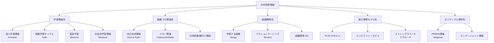
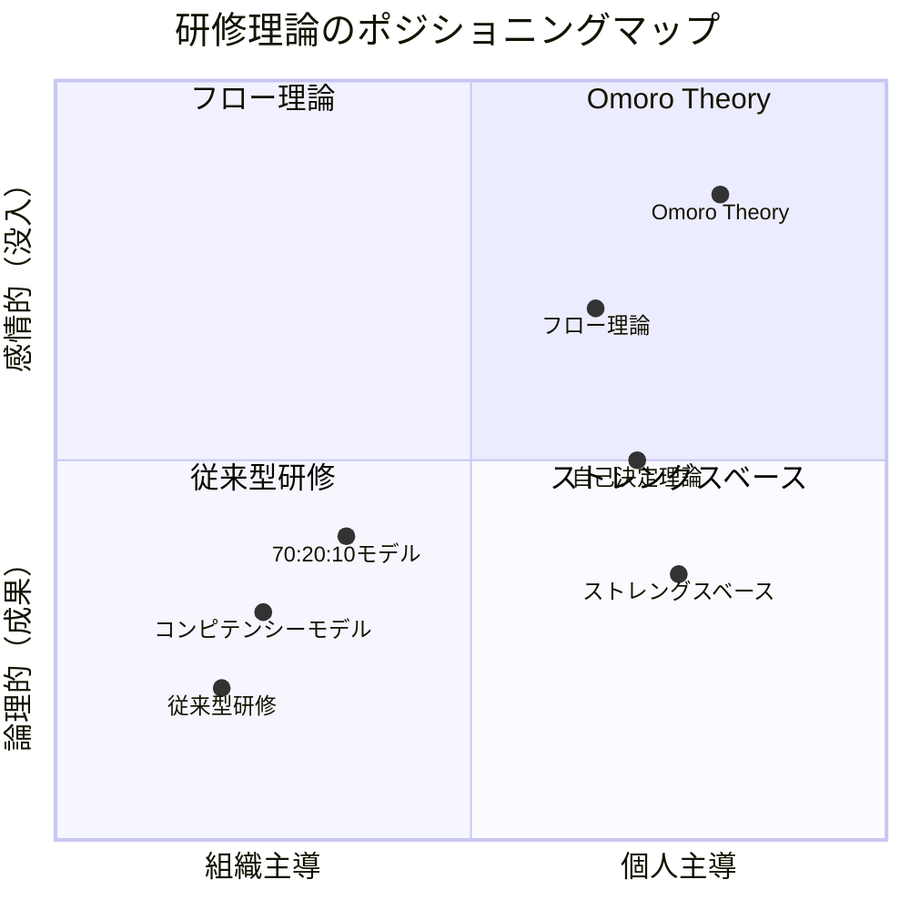
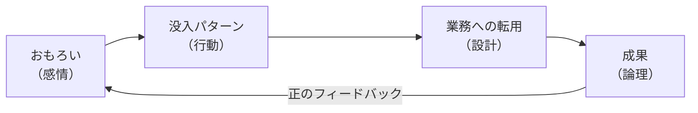
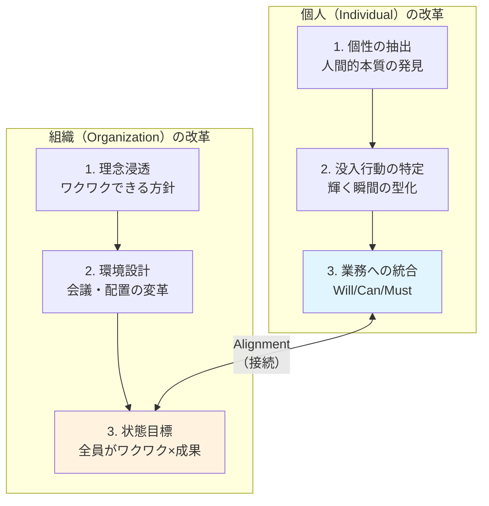
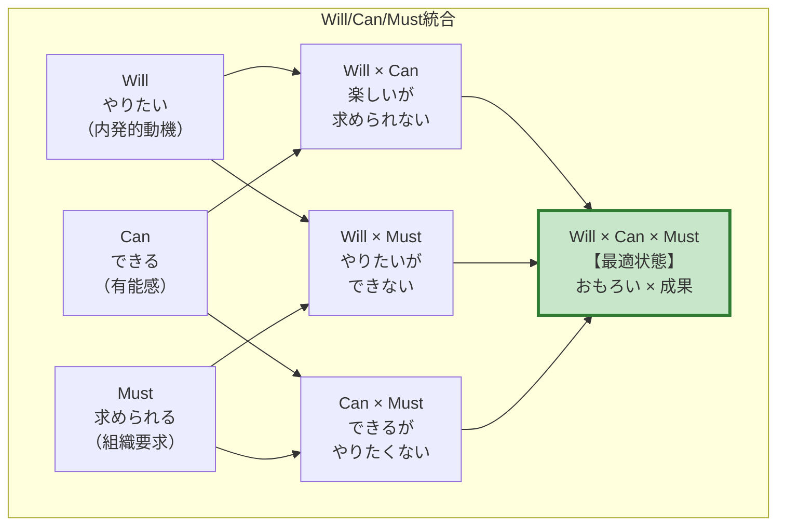
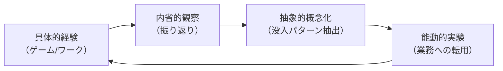
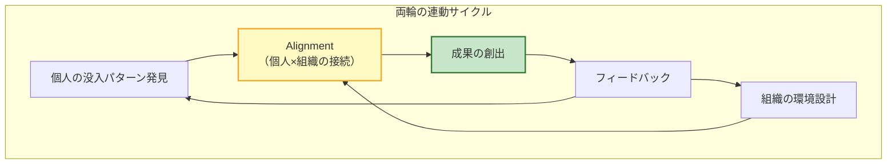

# Omoro Theory（オモロ理論）

**「おもろい」から始まる組織変革フレームワーク**

---

## Executive Summary

本レポートは、B2B研修領域における新たな理論体系「Omoro Theory（オモロ理論）」を提示する。従来の研修理論が「スキルの欠損を補う」という発想に立脚していたのに対し、本理論は**「おもろい（没入・熱中）」という感情を起点に、個人と組織の両方を同時に変革し、持続的な成果創出を実現する**という独自のアプローチを採用する。

### 本理論の3つの独自価値（USP）

1. **感情起点アプローチ**：「おもろい」という主観的感情を、再現可能な「没入パターン」として型化する
2. **改革の両輪モデル**：個人改革と組織改革を同時に回し、相互作用による持続的変革を実現する
3. **Will/Can/Must統合**：やりたい・できる・求められるの三要素が重なる状態を設計する

---

## 1. 理論の背景と問題意識

### 1.1 従来のB2B研修の限界

従来のB2B研修は、以下のような前提に立脚してきた。

| 従来の前提 | 問題点 |
|-----------|--------|
| 「社員にはスキルが不足している」（欠損モデル） | 受講者のモチベーションが上がらない |
| 「組織の要求に個人を適応させる」（Fitモデル） | 個人の主体性が失われる |
| 「知識を教えれば行動が変わる」（知識注入モデル） | 研修後の行動変容が起きない |
| 「Must（やるべきこと）を起点に設計」 | 持続性がなく、研修効果が減衰する |

これらの前提に基づく研修は、「研修を受けた直後は意識が高まるが、1週間で元に戻る」という現象を生み出してきた。

### 1.2 「おもろい」という未開拓領域

一方で、ビジネスの現場には次のような事実が存在する。

- 同じ業務でも、ある人は没頭し、ある人は苦痛を感じる
- 没入状態で働く人は、そうでない人より生産性が高い
- 「やらされ感」で働く人より「楽しんでいる」人の方が成果を出す

**「おもろい」という感情は、成果創出の強力なドライバーである**。しかし、これまでの研修理論はこの感情を「測定困難」「主観的」として体系化の対象から外してきた。Omoro Theoryは、この未開拓領域に挑戦する。

---

## 2. 既存理論との比較分析

### 2.1 B2B研修理論の全体像（ロジックツリー）

B2B研修分野における既存理論は、以下の5つの系譜に分類できる。

### 2.2 主要理論との共通点

Omoro Theoryは、既存理論の知見を統合的に活用する。

| 既存理論 | Omoro Theoryとの接点 |
|----------|---------------------|
| **フロー理論**（Csikszentmihalyi） | 「没入状態」の概念を借用。ただし、偶発的なフローではなく「意図的に再現可能な没入」を目指す |
| **自己決定理論**（Deci & Ryan） | 自律性・有能感・関係性の三欲求を、Will/Can/Must統合の学術的根拠として活用 |
| **経験学習サイクル**（Kolb） | 「体験起点の気づき」の方法論として活用。具体的経験→内省→概念化→実践のサイクル |
| **ストレングスベースアプローチ** | 欠損を補うのではなく強みを活かす発想を共有。ただし「強み」を「没入パターン」に置換 |

### 2.3 決定的差異（USP）の特定

| 比較軸 | 既存理論 | Omoro Theory | 差異の本質 |
|--------|----------|--------------|-----------|
| **起点** | スキル/知識の不足 | 「おもろい」という感情 | 欠損モデル → 充足モデル |
| **方向性** | 組織→個人（トップダウン） | 個人⇔組織（双方向） | 適応 → 接続（Alignment） |
| **変革対象** | 個人 OR 組織 | 個人 AND 組織（両輪） | 部分最適 → 全体最適 |
| **目標** | Mustの遂行 | Will/Can/Mustの統合 | 義務 → 統合 |
| **持続性** | 研修時のみ | 自己再現可能 | 一過性 → 持続性 |

**Omoro Theoryの独自ポジション**：個人の感情（おもろい）を起点としながら、組織の成果に確実に着地させる。これは既存理論の空白地帯である。

---

## 3. Omoro Theoryの理論体系

### 3.1 Core Concept：「おもろい × 成果」の同時実現

Omoro Theoryの核心は、**「おもろい」と「成果」を二項対立ではなく、同時に実現可能な目標として設計する**ことにある。

#### なぜ「おもろい」が「成果」に繋がるのか

1. **没入状態の生産性向上効果**：Csikszentmihalyiの研究によれば、フロー状態にある人は通常時の5倍の生産性を発揮する
2. **内発的動機の持続性**：外発的動機（報酬・罰則）は短期的効果しかないが、内発的動機は持続的に行動を駆動する
3. **創造性の発揮**：没入状態では認知資源が解放され、創造的な問題解決が可能になる

### 3.2 改革の両輪モデル（Individual × Organization）

Omoro Theoryは、**個人改革と組織改革を「両輪」として同時に回す**ことで、持続的な変革を実現する。

#### 個人改革の3ステップ

| ステップ | 内容 | 成果物 |
|----------|------|--------|
| **1. 個性の抽出** | Job Description上のスキルではなく、「人間的な本質」を発見する | 個性プロファイル |
| **2. 没入行動の特定** | 個性が活き、輝く瞬間を特定し、「型」として言語化する | 没入パターンシート |
| **3. 業務への統合** | 没入パターンを業務アクションに落とし込み、Will/Can/Mustが重なる状態を設計する | アクションプラン |

#### 組織改革の3ステップ

| ステップ | 内容 | 成果物 |
|----------|------|--------|
| **1. 理念浸透** | 個人がワクワクでき、かつ成果に繋がる理念・方針を作り浸透させる | 理念ステートメント |
| **2. 環境設計** | 会議の仕方や人員配置を変え、組織の目指す方向と個人の個性を接続する | 組織設計図 |
| **3. 状態目標** | 全員がワクワクしながら成果が出せる状態を定義し、目指す | 状態KPI |

### 3.3 Will/Can/Must統合フレームワーク

Omoro Theoryの最終目標は、**Will（やりたい）/ Can（できる）/ Must（求められる）が重なる状態を意図的に設計する**ことである。

#### 各状態の解説

| 状態 | 説明 | 問題点 |
|------|------|--------|
| **Will × Can のみ** | 楽しくて得意だが、組織から求められていない | 趣味止まり。評価されない |
| **Will × Must のみ** | やりたくて求められているが、スキルが不足 | 空回り。成果が出ない |
| **Can × Must のみ** | 得意で求められているが、やりたくない | 燃え尽き。持続しない |
| **Will × Can × Must** | やりたい・できる・求められるが重なる | **最適状態。おもろい × 成果** |

---

## 4. 学術的根拠と正当化

### 4.1 フロー理論との接続

Csikszentmihalyiのフロー理論は、Omoro Theoryの「没入」概念の学術的基盤を提供する。

**フロー状態の条件**：
1. 明確な目標がある
2. 即座のフィードバックがある
3. 挑戦とスキルのバランスが取れている

**Omoro Theoryの発展**：
- フロー理論が「偶発的に生じるフロー」を研究対象としたのに対し、Omoro Theoryは**「意図的に再現可能な没入パターン」**を設計対象とする
- 個人がフロー状態に入りやすい条件を「没入パターン」として型化し、業務に意図的に組み込む

### 4.2 自己決定理論との接続

Deci & Ryanの自己決定理論（SDT）は、内発的動機の三要素を提示している。

| SDTの三欲求 | Omoro Theoryでの対応 |
|-------------|---------------------|
| **自律性（Autonomy）** | Will：やりたいことを自分で選べる |
| **有能感（Competence）** | Can：できることで貢献できる |
| **関係性（Relatedness）** | Must：組織・他者から求められる |

**Omoro Theoryの発展**：
- SDTが三欲求の「充足」を目指すのに対し、Omoro Theoryは三要素の**「統合」**を目指す
- Will/Can/Mustが重なる状態を意図的に設計することで、内発的動機の最大化と組織成果の両立を実現する

### 4.3 経験学習理論との接続

Kolbの経験学習サイクルは、Omoro Theoryの「体験起点の気づき」の方法論的基盤を提供する。

**Omoro Theoryの発展**：
- 経験学習サイクルを「没入パターン発見→業務転用」という独自の文脈で再構成
- 座学（抽象的概念）からではなく、体験（具体的経験）から始める設計を徹底

---

## 5. 実践への応用

### 5.1 個人改革の方法論

個人改革は、以下の3つのワークを通じて実現する。

| ワーク名 | 目的 | 方法 | 成果物 |
|----------|------|------|--------|
| **個性発見ワーク** | 人間的本質の言語化 | 過去の没入体験の振り返り、他者からのフィードバック収集 | 個性プロファイル |
| **没入パターン抽出ワーク** | 輝く瞬間の型化 | ゲーム体験→観察→パターン抽出 | 没入パターンシート |
| **業務マッチングワーク** | Will/Can/Must統合 | 没入パターン × 現業務のマッチング分析 | アクションプラン |

### 5.2 組織改革の方法論

組織改革は、以下の3つの施策を通じて実現する。

| 施策名 | 目的 | 方法 | 成果物 |
|--------|------|------|--------|
| **理念再設計** | ワクワクできる方針の策定 | 経営層と現場のワークショップ | 理念ステートメント |
| **環境リデザイン** | 個人×組織の接続 | 会議体の見直し、人員配置の最適化 | 組織設計図 |
| **状態KPI設定** | ゴール状態の定義 | 没入度・エンゲージメントの測定設計 | 状態KPIダッシュボード |

### 5.3 両輪の連動メカニズム

個人改革と組織改革は、相互に連動することで効果を最大化する。

**連動の原則**：
1. 個人の没入パターンを発見しても、組織がそれを活かす環境を整えなければ成果に繋がらない
2. 組織が環境を整えても、個人が自分の没入パターンを理解していなければ活用できない
3. 両輪を同時に回すことで、初めて「おもろい × 成果」が実現する

---

## 6. 結論：Omoro Theoryの独自価値

### 6.1 理論的貢献

Omoro Theoryは、B2B研修理論に以下の貢献をもたらす。

1. **感情の理論化**：「おもろい」という主観的感情を、「没入パターン」という再現可能な概念に変換
2. **統合フレームワーク**：Will/Can/Mustの統合という、個人と組織の両方を満たす目標設定
3. **両輪モデル**：個人改革と組織改革の同時進行による、持続的変革の実現

### 6.2 実践的価値

企業にとってのOmoro Theoryの価値は以下の通りである。

| 観点 | 従来の研修 | Omoro Theory適用後 |
|------|----------|-------------------|
| **受講者のモチベーション** | 「やらされ感」 | 「おもろい」という内発的動機 |
| **研修効果の持続性** | 1週間で減衰 | 自己再現可能で持続 |
| **組織成果への接続** | 不明確 | Will/Can/Must統合により明確化 |
| **投資対効果** | 測定困難 | 没入度・成果の両面で測定可能 |

### 6.3 Omoro Theoryの一言定義

> **Omoro Theory（オモロ理論）とは、「おもろい」という感情を「没入パターン」として型化し、個人と組織の両輪改革を通じて、楽しみながら成果を出す状態を意図的に設計する理論体系である。**

---

## 付録：図表一覧

### 図1：B2B研修理論のロジックツリー
既存理論の5つの系譜（学習理論系、動機づけ理論系、組織開発系、能力開発モデル系、ポジティブ心理学系）とその代表的理論を整理。

### 図2：研修理論のポジショニングマップ
「組織主導⇔個人主導」「論理的（成果）⇔感情的（没入）」の2軸でOmoro Theoryの独自ポジションを可視化。

### 図3：「おもろい」から「成果」への変換プロセス
感情→行動→設計→成果の変換フローと、正のフィードバックループを図示。

### 図4：改革の両輪モデル
個人改革の3ステップと組織改革の3ステップ、およびAlignmentによる接続を図示。

### 図5：Will/Can/Must統合フレームワーク
三要素の重なりと、各部分領域の問題点、最適状態を図示。

### 図6：経験学習サイクルのOmoro Theory版
Kolbの経験学習サイクルを、没入パターン発見・業務転用の文脈で再構成。

### 図7：両輪の連動サイクル
個人改革と組織改革が相互に連動し、成果を創出するメカニズムを図示。

---

## 参考文献

- Csikszentmihalyi, M. (1990). *Flow: The Psychology of Optimal Experience*. Harper & Row.
- Deci, E. L., & Ryan, R. M. (2000). The "what" and "why" of goal pursuits: Human needs and the self-determination of behavior. *Psychological Inquiry*, 11(4), 227-268.
- Kolb, D. A. (1984). *Experiential Learning: Experience as the Source of Learning and Development*. Prentice-Hall.
- Knowles, M. S. (1980). *The Modern Practice of Adult Education: From Pedagogy to Andragogy*. Cambridge Adult Education.
- Senge, P. M. (1990). *The Fifth Discipline: The Art and Practice of the Learning Organization*. Doubleday.

---

*本レポートは irodori プロジェクトのために作成されました。*
*「おもろい」から始まる組織変革を、共に実現しましょう。*
