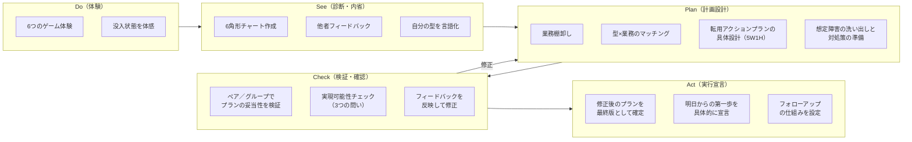
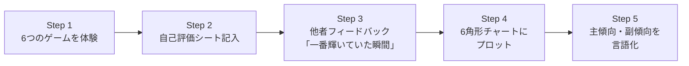
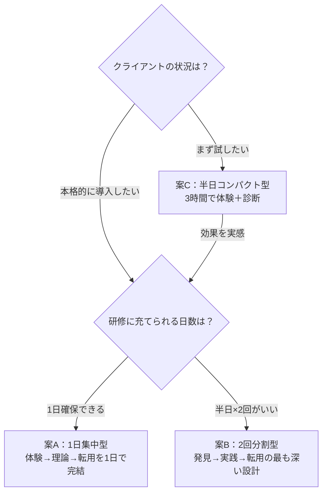

# irodori 研修プラン詳細案（3案）

**6角形チャート診断 × 型別ゲーム体験 × おもろ理論網羅型**

---

## 全案共通：研修フローの設計原則

### PDCAサイクルに基づく研修フロー

すべての案は、経験学習サイクル（Kolb）とPDCAサイクルを統合した以下のフローを必ず含む。



### Plan フェーズの設計

「アクションプランを書く」だけでは計画にならない。以下の要素を含む構造化されたPlan設計を行う。

| Plan要素 | 問い | 記入内容 |
|---------|------|---------|
| **What（何を）** | 具体的にどの業務を変えるか？ | （例：月次レポート作成） |
| **Why（なぜ）** | なぜその業務を選んだか？ | （例：毎月退屈で手応えがないから） |
| **How（どうやって）** | 自分の型をどう組み込むか？ | （例：攻略型→精度をスコア化し前月比で競う） |
| **When（いつから）** | 明日からの第一歩は？ | （例：今月のレポートから精度チェック項目を作る） |
| **Measure（測定）** | 効果をどう測るか？ | （例：レポート精度スコア、没入実感度） |
| **Obstacle（障害予測）** | 何がこの計画を阻む可能性があるか？ | （例：忙しいと元のやり方に戻りそう） |
| **Countermeasure（対処策）** | 障害にどう対処するか？ | （例：毎週金曜にスコアを記録する習慣を設定） |

### Check フェーズの設計

プランを「書いて終わり」にしないための検証プロセス。以下の **3つの問い** をペア/グループで相互に投げかける。

| # | 検証の問い | 目的 | NG例 |
|---|-----------|------|------|
| **Q1：月曜朝にできるか？** | 実現可能性の検証。「すぐ始められる」具体性があるか | 「意識を変える」「心がけるようにする」→ 行動でない |
| **Q2：1ヶ月後に自分で「できた/できなかった」と判定できるか？** | 測定可能性の検証。曖昧な目標を排除 | 「楽しく働く」→ 測定不能 |
| **Q3：あなたの型の「楽しさのトリガー」が含まれているか？** | 型との整合性の検証。努力目標ではなく「楽しめる設計」になっているか | 攻略型なのにゴール設定がない → 型と不一致 |

**Check後のアクション**: 3つの問いに1つでもNGがあれば、Plan に戻って修正する。修正→再Check を繰り返し、3つともOKになるまで磨く。

---

## 全案共通：6角形チャート診断の仕組み

### ヘキサゴンチャート（6角形レーダーチャート）

6つの楽しみ方の型を6角形の頂点に配置し、各受講者の傾向を可視化する。

```
            攻略型
           ／    ＼
        収集型      探究型
          |          |
        研磨型      創造型
           ＼    ／
            交流型
```

#### 診断の流れ



#### 評価方法（3層ハイブリッド）

| 層 | 方法 | 配点 | 根拠 |
|---|------|------|------|
| **ゲーム中の没入度**（他者観察） | 各ゲーム中に他の受講者が「この人が一番輝いていた」を投票 | 0〜5点 | おもろ理論の定義「個性が外から見えて輝いている状態」 |
| **自己評価** | 各ゲーム後に「楽しさ」「夢中になれた度合い」を5段階で記入 | 0〜5点 | 内省による自己認知 |
| **セルフチェック18問** | 各型3問×6型の質問紙 | 0〜5点（3問平均） | 場面への共感度による傾向測定 |

**3層の合計（各型最大15点）を6角形にプロットし、個人の「楽しみ方プロファイル」を可視化する。**

---

## 案A：1日集中型「没入パターン発見プログラム」

### 基本情報

| 項目 | 内容 |
|------|------|
| **研修名** | irodori 没入パターン発見プログラム〜自分の「おもろい」を見つけ、仕事に活かす1日〜 |
| **対象** | 中堅社員（入社5〜15年目） |
| **人数** | 18〜30名（6名×3〜5グループ） |
| **時間** | 7時間（10:00〜18:00、昼休憩1時間含む） |
| **形式** | 対面・会場型 |
| **価値提供類型** | ジャングルクルーズ型（ファシリテーターがリードしつつ受講者を主役に） |

### タイムテーブル

| 時間 | フェーズ | セクション | 内容 | おもろ理論の対応要素 |
|------|---------|-----------|------|---------------------|
| 10:00-10:30 | — | **オープニング：没入体験** | 照明ダウン＋BGM＋映像演出で「おもろい瞬間」のダイジェスト上映。「この研修は座学ではなく体験です」宣言 | Layer 4: 没入するシカケ（演出） |
| 10:30-11:00 | — | **講義①：おもろ理論概要** | 「おもろい」の定義、EX仮説、プロセスエコノミー、3類型の紹介 | Layer 0-2: 時代認識・経済構造・3類型 |
| 11:00-12:30 | **Do** | **ゲームラウンド前半（3ゲーム）** | 攻略型・探究型・創造型のゲームを各25分で体験 | Layer 3-4: エンタメ化原理・没入パターン6型 |
| 12:30-13:30 | — | 昼休憩 | — | — |
| 13:30-15:00 | **Do** | **ゲームラウンド後半（3ゲーム）** | 交流型・研磨型・収集型のゲームを各25分で体験 | Layer 3-4: エンタメ化原理・没入パターン6型 |
| 15:00-15:30 | **See** | **6角形チャート作成＋内省** | 3層評価を集計し、個人の6角形チャートを完成。主傾向・副傾向を言語化。「なぜこの型が高かったのか？」を内省 | 楽しみ方の型フレームワーク |
| 15:30-15:50 | — | **講義②：おもろ理論の全体像** | 改革の両輪モデル、Will/Can/Must統合、ジョブ・クラフティング | 改革の両輪・Will/Can/Must統合 |
| 15:50-16:40 | **Plan** | **転用設計ワーク（構造化Plan）** | ①業務棚卸し（10分）②型×業務マッチング（10分）③アクションプラン5W1H設計（15分）④想定障害の洗い出しと対処策（15分）。転用ヒントカード活用 | 業務への転用設計・不便益 |
| 16:40-17:20 | **Check** | **プラン検証セッション** | ペアで互いのプランを「3つの問い」で検証。①月曜朝にできるか？②1ヶ月後に判定できるか？③型の楽しさトリガーが入っているか？→NG箇所をPlanに戻って修正→再Checkを繰り返す | 品質チェック・相互フィードバック |
| 17:20-17:40 | **Act** | **最終プラン確定＋実行宣言** | Check通過後の最終版プランをグループ内で発表。「明日からの第一歩」を全員の前で宣言。フォローアップ方法（1ヶ月後の振り返り会 or オンラインチェックイン）を設定 | 自走するシカケ |
| 17:40-18:00 | — | **クロージング：「おもろい組織」へ** | 個人の変化が組織を変える「両輪モデル」の再確認。PDCAの「次のDo」への接続を明示 | 改革の両輪モデル |

### 6つのゲーム詳細

#### Game 1：タイムアタック・ミッション（攻略型）

| 項目 | 内容 |
|------|------|
| **形式** | グループ対抗・個人スコア制 |
| **時間** | 25分（説明3分＋プレイ17分＋振り返り5分） |
| **内容** | 5つのミッション（パズル・クイズ・暗号解読等）を制限時間内にクリア。ミッションごとに難易度が上がるステージ制。各ミッションにスコアがつき、クリアするとレベルアップ表示 |
| **設計意図** | 明確なゴール×即時フィードバック×段階的難易度 → 攻略型の没入トリガーを刺激 |
| **観察ポイント** | タイムプレッシャーの中で目が輝き、「あと1問！」と前のめりになる人 |
| **フロー条件** | ゴールの明確さ★★★、即時フィードバック★★★、挑戦とスキルのバランス★★★ |

#### Game 2：謎解きミステリー（探究型）

| 項目 | 内容 |
|------|------|
| **形式** | 個人＋グループ共有 |
| **時間** | 25分（説明3分＋プレイ17分＋振り返り5分） |
| **内容** | 架空の企業の「業績急回復の謎」をテーマにした推理ワーク。手がかりカード（顧客の声、売上データ、社員インタビュー等）が分散配置されており、自由に探索して真因を推理。最後に推理結果を発表 |
| **設計意図** | 未知の対象×自由な探索×「わかった！」の瞬間 → 探究型の没入トリガーを刺激 |
| **観察ポイント** | 手がかりを集めて「あ、そういうことか！」と目を見開く人 |
| **フロー条件** | 未知の対象★★★、探索の自由度★★★、発見のフィードバック★★☆ |

#### Game 3：90秒クリエイション（創造型）

| 項目 | 内容 |
|------|------|
| **形式** | 個人制作＋全体発表 |
| **時間** | 25分（説明3分＋プレイ17分＋振り返り5分） |
| **内容** | 制限された素材（紙、テープ、マーカー3色、割り箸、輪ゴム等）を使い、与えられたお題（例：「未来の通勤」「理想の休憩室」）を表現する作品を制作。90秒のプレゼンつき |
| **設計意図** | 表現の自由度×制約の中の工夫×「自分が作った」実感 → 創造型の没入トリガーを刺激 |
| **観察ポイント** | 素材を手にした瞬間に目が輝き、黙々と没頭し始める人 |
| **フロー条件** | 表現の自由度★★★、具現化の手段★★★、制約の存在★★☆ |

#### Game 4：チーム・サバイバル（交流型）

| 項目 | 内容 |
|------|------|
| **形式** | グループ全員参加・協力必須 |
| **時間** | 25分（説明3分＋プレイ17分＋振り返り5分） |
| **内容** | 全員が異なる「情報カード」を1枚ずつ持ち、口頭のみで情報を共有して正解にたどり着く協力型課題（いわゆる「情報共有ゲーム」の応用）。全員が発言しないとクリアできない設計 |
| **設計意図** | 仲間の存在×共通の目標×相互フィードバック → 交流型の没入トリガーを刺激 |
| **観察ポイント** | メンバーの話を引き出し、場をまとめようとする人。「みんなで解けた！」に一番喜ぶ人 |
| **フロー条件** | 仲間の存在★★★、共通の目標★★★、心理的安全性★★★ |

#### Game 5：マイスター・チャレンジ（研磨型）

| 項目 | 内容 |
|------|------|
| **形式** | 個人・時間無制限（枠内） |
| **時間** | 25分（説明3分＋プレイ17分＋振り返り5分） |
| **内容** | 一つの作業（例：A4用紙を使った紙飛行機の飛距離チャレンジ、マッチ棒パズルの最適解探し、折り紙の精度チャレンジ等）を制限なく繰り返し挑戦できる。回数制限なし、自分のペースで「もう一回」を繰り返す |
| **設計意図** | 集中できる環境×中断されない時間×段階的な改善実感 → 研磨型の没入トリガーを刺激 |
| **観察ポイント** | 周囲が気にならなくなり、「もう一回…もう一回…」と黙々と繰り返す人 |
| **フロー条件** | 集中できる環境★★★、中断されない時間★★★、段階的な改善実感★★☆ |

#### Game 6：コンプリート・ラリー（収集型）

| 項目 | 内容 |
|------|------|
| **形式** | 個人＋グループ共有 |
| **時間** | 25分（説明3分＋プレイ17分＋振り返り5分） |
| **内容** | 会場内に隠された20個の「知識カード」（おもろ理論のキーワードが書かれたカード）を探し集め、カテゴリ別に整理して「おもろ理論マップ」を完成させる。コンプリート度が可視化されるチェックシートつき |
| **設計意図** | コンプリート可能な対象×進捗の可視化×分類・整理の余地 → 収集型の没入トリガーを刺激 |
| **観察ポイント** | チェックシートを見て「あと3枚！」と俄然やる気を出す人。集めたカードを丁寧に整理する人 |
| **フロー条件** | コンプリート可能な対象★★★、進捗の可視化★★★、分類・整理の余地★★☆ |

### おもろ理論カバレッジ

| おもろ理論の要素 | 本研修での扱い |
|----------------|---------------|
| 「おもろい」の定義（個性が外から見えて輝いている状態） | オープニング＋講義①＋ゲーム中の他者観察 |
| EX仮説（エンターテイメント・トランスフォーメーション） | 講義① |
| プロセスエコノミー（アウトプット→プロセス） | 講義① |
| 3類型（レストラン/ジャングルクルーズ/BBQ） | 講義①＋研修自体がジャングルクルーズ型 |
| エンタメ化の原理（没入状態の設計） | 講義①＋6ゲーム体験そのもの |
| 3つのシカケ（没入/不便益/自走） | オープニング演出＋ゲーム設計＋Planワーク（不便益）＋Act宣言（自走） |
| 没入パターン6つの型 | 6ゲーム（Do）＋6角形チャート診断（See） |
| Will/Can/Must統合 | 講義②＋Planワーク |
| 改革の両輪モデル | 講義②＋クロージング |
| ジョブ・クラフティング | Planワーク（型×業務マッチング） |
| フロー理論（学術的基盤） | 講義①②で随時引用 |
| 自己決定理論（学術的基盤） | 講義②でWill/Can/Mustとの接続 |
| 経験学習サイクル | 研修全体がDo→See→Plan→Check→Actの構造 |
| **PDCAサイクル** | **Plan=転用設計ワーク、Check=3つの問い検証、Act=宣言＋フォローアップ設定** |

### 成果物

| 成果物 | フェーズ | 内容 |
|--------|---------|------|
| **個人の6角形チャート** | See | 6型の傾向スコアをプロットした個人プロファイル |
| **没入パターンシート** | See | 主傾向・副傾向、楽しさのトリガー、没入条件の言語化 |
| **構造化アクションプラン（5W1H＋障害対策つき）** | Plan | 型×業務マッチング、具体的行動、測定方法、想定障害と対処策 |
| **Check済み最終プラン** | Check→Act | 3つの問いをクリアした検証済みプラン。フォローアップ日程つき |

---

## 案B：2回分割型「発見＋転用プログラム」

### 基本情報

| 項目 | 内容 |
|------|------|
| **研修名** | irodori 没入パターン活用プログラム〜「発見」と「転用」の2ステップ〜 |
| **対象** | 中堅社員（入社5〜15年目） |
| **人数** | 12〜24名（4〜6名×3〜4グループ） |
| **時間** | 3.5時間×2回（Day1: 発見編、Day2: 転用編）※2週間〜1ヶ月の間隔 |
| **形式** | 対面・会場型 |
| **価値提供類型** | Day1: ジャングルクルーズ型 → Day2: BBQ型（自走に移行） |

### Day1：発見編（3.5時間）— Do＋See

| 時間 | フェーズ | セクション | 内容 | おもろ理論の対応要素 |
|------|---------|-----------|------|---------------------|
| 0:00-0:20 | — | **オープニング演出** | 照明ダウン＋映像「あなたが最後に夢中になったのはいつですか？」。1分間の黙想→ペアで共有 | 没入するシカケ（演出＋共通話題） |
| 0:20-0:50 | — | **講義：おもろ理論 Part1** | 「おもろい」の定義、EX仮説、プロセスエコノミー、3類型、エンタメ化の原理、3つのシカケの全体像 | Layer 0-4: おもろ理論全体像 |
| 0:50-1:10 | **Do** | **ウォームアップゲーム：「おもろい人探し」** | 会場内を自由に歩き回り、5人と「最近夢中になったこと」を30秒ずつ交換。聞いた話の中で「一番おもろい！」と思った人に投票 | 没入するシカケ（緊張緩和）＋交流型体験 |
| 1:10-2:40 | **Do** | **6ゲームサーキット** | 6つのゲームステーションを15分ずつ回転（移動・切替含む各18分）。全員が全ゲームを体験 | 没入パターン6型の体験 |
| 2:40-3:10 | **See** | **6角形チャート作成＋内省＋グループ共有** | 3層評価集計→チャート作成→「なぜこの型が高かったのか？」を内省→グループ内で結果共有＋他者フィードバック（「あなたはこのゲームの時が一番輝いてた」） | 楽しみ方の型フレームワーク診断 |
| 3:10-3:30 | — | **Day1クロージング＋課題提示** | Day1のまとめ。Day2までの課題：①家族・友人に「自分が一番楽しそうに見える時」を聞く ②自分の業務を棚卸しする ③没入ジャーナル（毎日「夢中になった瞬間」を1つ記録） | 他者フィードバック＋業務棚卸し |

#### Day1の6ゲームステーション（サーキット形式）

各ステーションを15分で回転する短縮版。案Aのゲームをコンパクト化。

| Station | ゲーム名 | 型 | 短縮版の工夫 |
|---------|---------|---|-------------|
| S1 | **スピードクリア** | 攻略型 | 3ステージのパズル。1ステージ3分のタイムアタック |
| S2 | **ミニミステリー** | 探究型 | 手がかりカード5枚から真因を推理する1問完結型 |
| S3 | **60秒ビルド** | 創造型 | 限定素材で60秒×3ラウンド。毎ラウンドお題が変わる |
| S4 | **伝言ミッション** | 交流型 | 口頭のみで図形情報を伝達し、全員で正解を完成させる |
| S5 | **精度チャレンジ** | 研磨型 | 紙コップタワーの高さ×安定性を何度でもやり直し可能 |
| S6 | **キーワードハント** | 収集型 | ステーション周辺の隠しキーワード10個を見つけてリスト完成 |

### Day2：転用編（3.5時間）※2週間〜1ヶ月後 — Plan＋Check＋Act

| 時間 | フェーズ | セクション | 内容 | おもろ理論の対応要素 |
|------|---------|-----------|------|---------------------|
| 0:00-0:20 | **See（深化）** | **リコネクト＋チャート更新** | Day1の6角形チャートを再確認。家族・友人からのフィードバック結果＋没入ジャーナルの振り返りを踏まえ、チャートをv2に更新 | 他者フィードバック照合・診断の深化 |
| 0:20-0:50 | — | **講義：おもろ理論 Part2** | Will/Can/Must統合フレームワーク、改革の両輪モデル、ジョブ・クラフティング、状態KPI。**「なぜPlanとCheckが必要か」を明示** | Will/Can/Must統合・改革の両輪 |
| 0:50-1:20 | **Plan①** | **業務棚卸しワーク** | 現在の業務をリストアップし、各業務の「楽しさ」「退屈さ」を5段階評価。退屈な業務の「退屈ポイント」を特定。型×業務のマッチング分析 | 業務への転用設計（Plan準備） |
| 1:20-1:30 | — | 休憩 | — | — |
| 1:30-2:10 | **Plan②** | **転用設計ワークショップ（BBQ型）** | ファシリテーターは「場」と「素材（転用ヒントカード＋5W1Hシート＋障害対策シート）」だけ提供。グループ内で互いの型と業務を掛け合わせ、**構造化されたアクションプラン（5W1H＋障害予測＋対処策）**を設計。自走させる | BBQ型体験＋不便益＋自走するシカケ |
| 2:10-2:50 | **Check** | **プラン検証ラウンド** | ①ペアで互いのプランを「3つの問い」で検証（15分）→②NG箇所をPlanに戻って修正（10分）→③再Checkして全問OKを確認（5分）→④グループ代表のプランを全体で共有しファシリテーターがライブCheck（10分） | 品質チェック・相互フィードバック |
| 2:50-3:10 | **Act** | **最終プラン確定＋実行宣言＋フォローアップ設定** | Check通過後の最終版プランを確定。「明日からの第一歩」を全員の前で宣言。**フォローアップの仕組みを設定**：1ヶ月後の振り返り会の日程確定、もしくはオンラインチェックイン（週1の1行報告）の方法を決定 | 自走するシカケ |
| 3:10-3:30 | — | **クロージング：おもろい組織へ** | 個人の没入パターン活用→チーム編成への活用→組織改革へ。「両輪モデル」の実践宣言。**PDCAの「次のDo」はフォローアップ会で確認** | 改革の両輪モデル・組織活用 |

### Day1→Day2の間の課題（不便益の設計）

受講者に「自分で考え、行動する」課題を出すことで、不便益の原理を体験させる。

| 課題 | 目的 | 不便益の効果 |
|------|------|-------------|
| **家族・友人に聞く**: 「私が一番楽しそうに見えるのはどんな時？」 | 他者視点の獲得 | 自分で聞きに行く「不便」→ 得られる「気づき」の深さ |
| **業務棚卸し**: 今の業務を全てリストアップする | 転用設計の準備 | 自分で整理する「不便」→ 業務の解像度が上がる |
| **没入ジャーナル**: 2週間、「夢中になった瞬間」を毎日1つメモ | 日常の没入パターン認知 | 毎日記録する「不便」→ パターンが浮かび上がる |

### おもろ理論カバレッジ

| おもろ理論の要素 | Day1 | Day2 | カバー方法 |
|----------------|------|------|-----------|
| 「おもろい」の定義 | ✅ | ✅ | 講義＋ゲーム中の他者観察＋リコネクト |
| EX仮説 | ✅ | — | 講義Part1 |
| プロセスエコノミー | ✅ | — | 講義Part1 |
| 3類型 | ✅ | ✅ | 講義Part1＋Day2はBBQ型を体験 |
| エンタメ化の原理 | ✅ | — | 講義Part1＋ゲーム体験 |
| 3つのシカケ | ✅ | ✅ | 演出＋ゲーム＋中間課題（不便益）＋Day2の自走 |
| 没入パターン6型 | ✅ | ✅ | 6ゲーム（Do）＋6角形チャート（See）＋リコネクト |
| Will/Can/Must統合 | — | ✅ | 講義Part2＋Planワーク |
| 改革の両輪モデル | — | ✅ | 講義Part2＋クロージング |
| ジョブ・クラフティング | — | ✅ | Planワーク（型×業務マッチング） |
| フロー理論 | ✅ | ✅ | 講義で随時引用 |
| 自己決定理論 | — | ✅ | Will/Can/Must接続 |
| 経験学習サイクル | ✅ | ✅ | Day1=Do→See、Day2=Plan→Check→Act |
| **PDCAサイクル** | — | ✅ | **Plan=構造化ワーク、Check=3つの問い検証、Act=宣言＋FU設定** |

### 成果物

| 成果物 | フェーズ | タイミング |
|--------|---------|----------|
| **個人の6角形チャート（v1）** | See | Day1終了時 |
| **他者フィードバック結果** | See（深化） | Day1→Day2の間 |
| **没入ジャーナル** | See（深化） | Day1→Day2の間（継続） |
| **個人の6角形チャート（v2）**（v1＋他者FB＋ジャーナル反映） | See（深化） | Day2冒頭 |
| **業務棚卸しシート** | Plan① | Day2 |
| **構造化アクションプラン（5W1H＋障害対策つき）** | Plan② | Day2 |
| **Check済み最終プラン** | Check→Act | Day2終了時 |
| **フォローアップ日程＋チェックイン方法** | Act | Day2終了時 |

---

## 案C：半日コンパクト型「おもろ診断プログラム」

### 基本情報

| 項目 | 内容 |
|------|------|
| **研修名** | irodori おもろ診断〜3時間で見つける「自分の楽しみ方」〜 |
| **対象** | 中堅社員（入社5〜15年目）。導入検討のためのトライアル実施にも対応 |
| **人数** | 12〜36名（6名×2〜6グループ） |
| **時間** | 3時間（例：14:00〜17:00） |
| **形式** | 対面・会場型 |
| **価値提供類型** | ジャングルクルーズ型（テンポよくリードし、短時間で核心を体験させる） |

### タイムテーブル

| 時間 | フェーズ | セクション | 内容 | おもろ理論の対応要素 |
|------|---------|-----------|------|---------------------|
| 0:00-0:10 | — | **インパクト・オープニング** | 照明ダウン＋映像＋BGMで「夢中になる瞬間」のモンタージュ上映（世界のスポーツ選手、職人、アーティストの没入シーン）。「この状態を、あなたの仕事で再現しませんか？」 | 没入するシカケ（演出） |
| 0:10-0:25 | — | **おもろ理論エッセンス** | 15分で理論の核心を伝える：①「おもろい」の定義 ②EX仮説（なぜ今、体験が重要か）③没入パターンは型化できる ④6つの楽しみ方の型 ⑤型を知れば仕事が変わる | Layer 0-3全体像＋没入パターン6型 |
| 0:25-0:35 | — | **セルフチェック18問** | 質問紙に回答し、6型の暫定スコアを算出。「これが本当に自分の型かどうか、今から体験で確かめます」 | 楽しみ方の型フレームワーク診断（自己評価層） |
| 0:35-1:35 | **Do** | **ゲームラウンド（6ゲーム×10分）** | 6つの短縮ゲームをテンポよく回転。各ゲーム8分＋切替2分 | 没入パターン6型の体験 |
| 1:35-1:45 | — | 休憩 | — | — |
| 1:45-2:00 | **See** | **6角形チャート完成＋内省** | ゲーム中の自己評価＋他者観察＋セルフチェックの3層を集計。6角形チャートを完成。「なぜこの型が高かったのか？」を1分で言語化 | 6角形チャート診断 |
| 2:00-2:10 | — | **おもろ理論の「転用」エッセンス** | Will/Can/Must統合の概要、改革の両輪モデルの概要、ジョブ・クラフティングの考え方。「型がわかったら、こう使う」。**PlanとCheckの重要性を説明** | Will/Can/Must統合・改革の両輪・3つのシカケ |
| 2:10-2:30 | **Plan** | **クイック転用Plan** | 転用ヒントカード（型別）を使い、自分の業務に1つだけ転用行動を設計。**ミニPlanシート（What/How/When/Measure の4項目）**に記入。「書いて終わりではない、次にCheckします」と予告 | 業務転用設計＋不便益（自分で考える） |
| 2:30-2:45 | **Check** | **ペアCheck＆修正** | ペアで互いのプランを**「3つの問い」で検証**：①月曜朝にできるか？②1ヶ月後に判定できるか？③型の楽しさトリガーが入っているか？→NG箇所を修正→再Checkで全問OK確認 | 品質チェック・相互フィードバック |
| 2:45-3:00 | **Act** | **最終プラン確定＋実行宣言** | Check済みプランを最終確定。各グループ代表1名が「自分の型と明日からの第一歩」を全体に発表。ファシリテーターの総括。**「1ヶ月後に第一歩の結果を自己判定してください」**と次のDoへ接続 | 自走するシカケ（宣言→実行） |

### 6つの短縮ゲーム（各8分）

| # | ゲーム名 | 型 | 内容（8分版） | 判定ポイント |
|---|---------|---|-------------|-------------|
| G1 | **ステージクリア** | 攻略型 | 3つのミニパズルを制限時間内にクリア。各パズル2分。全クリアでボーナスポイント | 時間内にクリアしようと燃えるか |
| G2 | **Why探偵** | 探究型 | 1枚のデータシート（架空の売上グラフ）を見て「なぜこの変動が起きたか？」を推理。手がかりカード3枚を追加取得可能 | 仮説を立てて検証しようとするか |
| G3 | **ワンミニッツ・アート** | 創造型 | A4紙1枚＋マーカー3色で「自分の仕事を一言で表すビジュアル」を60秒で制作×3ラウンド | 制作に没頭し、表現にこだわるか |
| G4 | **バインドコミュニケーション** | 交流型 | 各自が背中に貼られたキーワード（自分には見えない）を、他のメンバーのヒントだけで当てる。全員正解で成功 | 人に聞きに行く、ヒントを出す側で活き活きするか |
| G5 | **精密フォールド** | 研磨型 | 折り紙で指定の作品を作る。見本と寸分違わぬ精度を目指す。何度でもやり直し可能 | 微調整を繰り返して満足いくまで追求するか |
| G6 | **ミニ図鑑コンプリート** | 収集型 | テーブル上に散らばった30枚の情報カードから、指定カテゴリ5つ×各3枚＝15枚を選び出してマップに配置 | カードを集め・分類する作業に没頭するか |

### おもろ理論カバレッジ

| おもろ理論の要素 | カバー | 方法 |
|----------------|--------|------|
| 「おもろい」の定義 | ✅ | オープニング＋エッセンス講義＋他者観察 |
| EX仮説 | ✅ | エッセンス講義（簡潔に） |
| プロセスエコノミー | ✅ | エッセンス講義（簡潔に） |
| 3類型 | ✅ | エッセンス講義（簡潔に）＋研修自体がジャングルクルーズ型 |
| エンタメ化の原理 | ✅ | エッセンス講義＋ゲーム体験 |
| 3つのシカケ | ✅ | 演出（没入）＋Planワーク（不便益）＋Act宣言（自走） |
| 没入パターン6型 | ✅ | 6ゲーム（Do）＋6角形チャート（See） |
| Will/Can/Must統合 | ✅ | 転用エッセンス講義 |
| 改革の両輪モデル | ✅ | 転用エッセンス講義＋クロージング |
| ジョブ・クラフティング | ✅ | クイックPlanワーク |
| フロー理論 | ✅ | エッセンス講義で簡潔に引用 |
| 自己決定理論 | ✅ | Will/Can/Mustとの接続で引用 |
| 経験学習サイクル | ✅ | 研修全体がDo→See→Plan→Check→Actの構造 |
| **PDCAサイクル** | ✅ | **Plan=ミニPlanシート、Check=3つの問いペア検証、Act=宣言＋自己判定設定** |

### 成果物

| 成果物 | フェーズ | 内容 |
|--------|---------|------|
| **個人の6角形チャート** | See | 3層評価に基づく個人プロファイル |
| **ミニPlanシート（What/How/When/Measure）** | Plan | 自分の型×業務の転用行動を構造化 |
| **Check済み「明日からの第一歩」カード** | Check→Act | 3つの問いをクリアした検証済みの転用アクション |

---

## 3案の比較表

| 比較項目 | 案A：1日集中型 | 案B：2回分割型 | 案C：半日コンパクト型 |
|---------|--------------|--------------|-------------------|
| **所要時間** | 7時間（1日） | 3.5時間×2回（計7時間） | 3時間 |
| **推奨人数** | 18〜30名 | 12〜24名 | 12〜36名 |
| **ゲーム1本の時間** | 25分（じっくり） | 15分（サーキット） | 8分（テンポ重視） |
| **理論の深さ** | ★★★（講義2回、計1時間） | ★★★（Day1＋Day2で計1時間） | ★★☆（エッセンス25分） |
| **Plan の深さ** | ★★★（5W1H＋障害対策、50分） | ★★★★（業務棚卸し＋BBQ型設計、70分） | ★★☆（ミニPlanシート、20分） |
| **Check の深さ** | ★★★（3つの問い＋修正、40分） | ★★★★（ペア＋ライブCheck、40分） | ★★☆（ペアCheck、15分） |
| **おもろ理論カバレッジ** | 全要素＋PDCAカバー | 全要素＋PDCAカバー（最も深い） | 全要素＋PDCAカバー（簡潔に） |
| **不便益の活用** | Planワーク（自分で設計） | Day間課題＋BBQ型（最も効果的） | Planワーク（自分で考える） |
| **BBQ型の体験** | — | Day2がBBQ型 | — |
| **フォローアップ** | Check済みプラン＋FU日程設定 | Check済みプラン＋没入ジャーナル＋FU日程設定 | Check済み「第一歩」カード＋自己判定 |
| **価値提供類型** | ジャングルクルーズ型 | JC型→BBQ型（段階移行） | ジャングルクルーズ型 |
| **最適な導入シーン** | 初回導入（本格版） | 継続プログラム | トライアル・導入検討 |
| **概算費用感** | ★★★ | ★★★★ | ★★ |

### 推奨シーン



---

## 付録：6角形チャート テンプレート

```
                    攻略 (   /15)
                   ╱  ╲
                 ╱      ╲
               ╱    ╱╲    ╲
             ╱   ╱    ╲     ╲
    収集   ╱  ╱        ╲     ╲ 探究
  (  /15) ╱╱            ╲╲ (  /15)
           ╲╲            ╱╱
    研磨   ╲  ╲        ╱     ╱ 創造
  (  /15) ╲   ╲    ╱     ╱ (  /15)
             ╲    ╲╱    ╱
               ╲      ╱
                 ╲  ╱
                    交流 (   /15)

【記入例】
  主傾向：___________型（最高スコアの型）
  副傾向：___________型（2番目のスコアの型）
  あなたの複合型名：「_________×_________」型
```

### 6角形チャートの読み方ガイド

| パターン | 特徴 | アドバイス |
|---------|------|----------|
| **1つの頂点が突出** | 明確な主傾向がある | その型の転用方法を深掘りする |
| **隣り合う2つが高い** | 関連する楽しさの複合型 | 2つの型を組み合わせた転用設計が効果的 |
| **対角の2つが高い** | 対照的な楽しさを持つユニークなタイプ | 場面に応じて「スイッチ」できる強みがある |
| **全体的にフラット** | すべてをバランスよく楽しめる | どの状況でも適応できる。環境設計を意識すると◎ |
| **全体的に低い** | 研修の場では没入しにくかった可能性 | 日常の没入体験を振り返り、別の角度から型を探る |

---

## 付録：転用ヒントカード一覧

研修中に配布し、転用設計ワークで使用するカード。

### 攻略型カード（赤）

| # | ヒント | 具体例 |
|---|--------|-------|
| A-1 | 業務をステージ制にする | 月間目標をBronze/Silver/Gold/Platinumの4段階に |
| A-2 | 自己ベスト記録をつける | 処理件数、応答速度、提案採用率等の個人記録 |
| A-3 | 「今月のボス」を決める | 最も難しい案件/課題を「ボス戦」と位置づけ、攻略する |

### 探究型カード（青）

| # | ヒント | 具体例 |
|---|--------|-------|
| B-1 | 週1回「なぜ？」タイムを作る | 定型業務の「なぜこのやり方？」を15分調べる |
| B-2 | データから法則を見つける | 業務データの中に隠れたパターンを1つ発見する |
| B-3 | 他部署を「取材」する | 月1回、別部署の人に15分のインタビューをする |

### 創造型カード（黄）

| # | ヒント | 具体例 |
|---|--------|-------|
| C-1 | テンプレに+αを加える | 報告書、メール、資料に自分ならではの工夫を1つ |
| C-2 | 「この資料は作品」と決める | 今月の1つのアウトプットを「自分の代表作」として仕上げる |
| C-3 | 業務改善アイデアを週1つ出す | 小さくても「自分発」の改善を継続的に出す |

### 交流型カード（緑）

| # | ヒント | 具体例 |
|---|--------|-------|
| D-1 | 週1回ペアワークを入れる | 一人でやっている業務を、誰かと一緒にやる時間を作る |
| D-2 | 「ありがとう」を可視化する | 感謝メモ、チャットでの感謝リレー、サンクスカード |
| D-3 | チームの合言葉を作る | 今月のプロジェクトに全員で決めた合言葉を設定 |

### 研磨型カード（紫）

| # | ヒント | 具体例 |
|---|--------|-------|
| E-1 | ディープワークタイムを確保 | 毎日1時間、通知オフで集中する時間をブロック |
| E-2 | 前回より1%良くする | 毎回の業務で「前回からの改善ポイント」を1つ見つける |
| E-3 | 「匠の領域」を1つ決める | 自分が社内No.1を目指す専門領域を1つ選ぶ |

### 収集型カード（橙）

| # | ヒント | 具体例 |
|---|--------|-------|
| F-1 | 業務知識を「図鑑」にする | 担当業務のナレッジを自分のデータベースとして蓄積 |
| F-2 | 「あと○件」カウンターを作る | 目標に対する残数を可視化し、コンプリートを目指す |
| F-3 | 過去事例のアーカイブを構築 | 成功/失敗事例を分類・整理したデータベースを作る |

---

**Document Information**
- Version: 2.0（Plan・Checkフェーズ追加）
- Created: 2026-02-09
- Author: CEO/Orchestrator Agent
- Status: Draft
- Based on: Omoro Theory V2, Immersion Pattern Framework V1.1, Entertainmentization Theory
