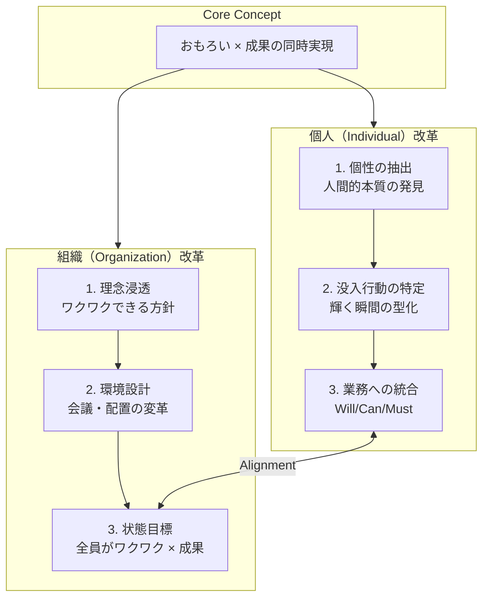
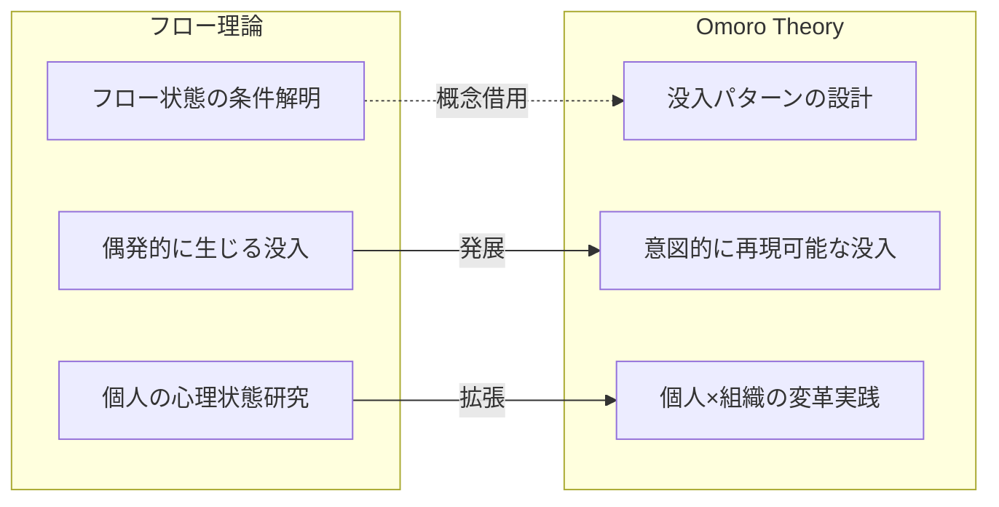
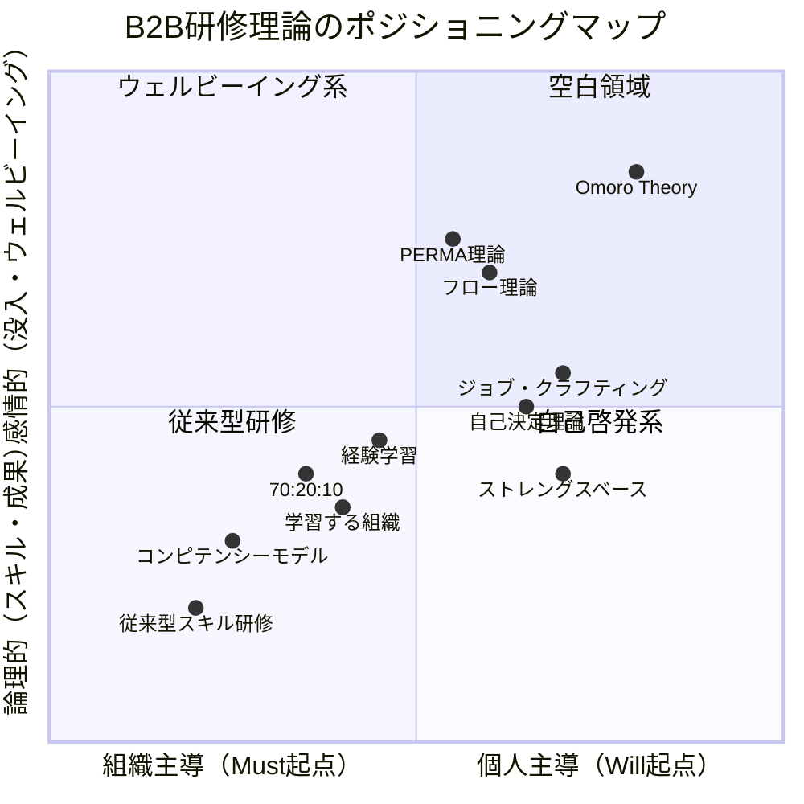
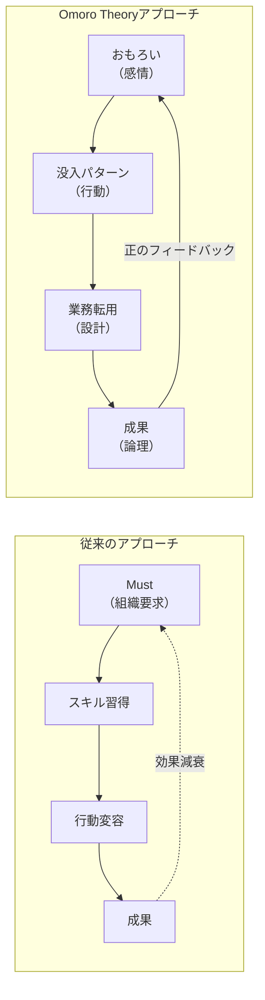
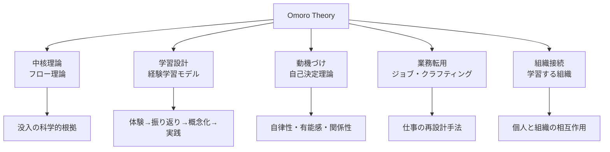

# ロジック設計レポート V2

**Omoro Theory（オモロ理論）の理論的位置づけと独自価値の分析**

作成日: 2026-01-22
作成者: ロジックデザイナー

---

## 1. ロジックツリー

### 1.1 B2B研修理論の5系譜（全体構造）

```mermaid
graph TD
    ROOT[B2B研修理論の体系]

    ROOT --> A[1. 学習理論系]
    ROOT --> B[2. 動機づけ理論系]
    ROOT --> C[3. 組織開発系]
    ROOT --> D[4. 能力開発モデル系]
    ROOT --> E[5. ポジティブ心理学系]

    A --> A1[成人学習理論<br/>Knowles, 1970s]
    A --> A2[経験学習サイクル<br/>Kolb, 1984]
    A --> A3[変容学習<br/>Mezirow, 1978]
    A --> A4[社会的学習理論<br/>Bandura]

    B --> B1[自己決定理論<br/>Deci & Ryan, 1985]
    B --> B2[フロー理論<br/>Csikszentmihalyi, 1975]
    B --> B3[内発的動機付け理論]

    C --> C1[学習する組織<br/>Senge, 1990]
    C --> C2[アクションラーニング<br/>Revans, 1930s]
    C --> C3[組織開発 OD]

    D --> D1[70:20:10モデル<br/>Lombardo, 1996]
    D --> D2[コンピテンシーモデル<br/>McClelland, 1970s]
    D --> D3[ストレングスベース<br/>Gallup, 2001]

    E --> E1[PERMA理論<br/>Seligman, 2011]
    E --> E2[エンゲージメント理論<br/>Kahn, Schaufeli]
    E --> E3[ジョブ・クラフティング<br/>Wrzesniewski, 2001]
```



### 1.2 各系譜の詳細構造

#### 1.2.1 学習理論系

```
学習理論系
├── 成人学習理論（Andragogy）
│   ├── 前提：成人は自己主導的に学ぶ
│   ├── 特徴：経験を学習資源として活用
│   ├── 方法：問題解決志向のコンテンツ設計
│   └── 限界：全成人が自律的学習者とは限らない
│
├── 経験学習サイクル（Kolb Model）
│   ├── Step 1：具体的経験（Concrete Experience）
│   ├── Step 2：内省的観察（Reflective Observation）
│   ├── Step 3：抽象的概念化（Abstract Conceptualization）
│   ├── Step 4：能動的実験（Active Experimentation）
│   └── 限界：サイクルが線形的すぎるという批判
│
├── 変容学習（Transformative Learning）
│   ├── 核心：既存の準拠枠（前提）の批判的省察
│   ├── 契機：ディスオリエンティング・ジレンマ
│   ├── 目標：視点変容（Perspective Transformation）
│   └── 限界：短期研修での実現が困難
│
└── 社会的学習理論（Bandura）
    ├── 核心：他者観察を通じた学習
    ├── 4要素：注意・保持・再生・動機づけ
    ├── 目標：自己効力感の向上
    └── 限界：モデルとなる他者の存在が前提
```

#### 1.2.2 動機づけ理論系

```
動機づけ理論系
├── 自己決定理論（SDT）
│   ├── 自律性（Autonomy）：自分で選べる
│   ├── 有能感（Competence）：できると感じる
│   ├── 関係性（Relatedness）：繋がっている
│   ├── 動機の連続体：外的調整 → 統合的調整 → 内発的動機
│   └── 限界：文化差への配慮、短期効果の測定困難
│
├── フロー理論（Flow Theory）
│   ├── 条件1：明確な目標
│   ├── 条件2：即座のフィードバック
│   ├── 条件3：挑戦とスキルのバランス
│   ├── 状態：没入・時間感覚消失・自己意識低下
│   └── 限界：意図的生成の困難さ、個人差
│
└── 内発的動機付け理論
    ├── 起点：興味・関心・好奇心
    ├── 特徴：持続性が高い、創造性を促進
    ├── 対比：外発的動機（報酬・罰則）
    └── 限界：全業務を内発的動機化は不可能
```

#### 1.2.3 組織開発系

```
組織開発系
├── 学習する組織（Senge）
│   ├── 1. システム思考（Fifth Discipline）
│   ├── 2. 自己マスタリー
│   ├── 3. メンタルモデル
│   ├── 4. 共有ビジョン
│   ├── 5. チーム学習
│   └── 限界：組織文化変革に時間がかかる
│
├── アクションラーニング（Revans）
│   ├── 公式：L = P + Q（学習 = 知識 + 質問）
│   ├── 6要素：問題・グループ・質問・行動・学習・コーチ
│   ├── 特徴：実際の課題を題材にする
│   └── 限界：複数セッション必要、ファシリ専門性
│
└── 組織開発（OD）
    ├── 介入：計画的変革プロセス
    ├── 対象：文化・構造・プロセス
    ├── 手法：サーベイフィードバック、チームビルディング
    └── 限界：経営層コミットメント必須
```

#### 1.2.4 能力開発モデル系

```
能力開発モデル系
├── 70:20:10モデル（ロミンガーの法則）
│   ├── 70%：経験からの学習（OJT）
│   ├── 20%：他者との関係（メンタリング）
│   ├── 10%：正式な学習（研修）
│   └── 限界：数字の実証性に疑義
│
├── コンピテンシーモデル
│   ├── 定義：高業績者の思考・行動特性
│   ├── 用途：採用・評価・育成の基準
│   ├── 前提：過去の成功パターンの一般化
│   └── 限界：環境変化で陳腐化
│
└── ストレングスベースアプローチ
    ├── 前提：弱み克服より強み伸長が効果的
    ├── 方法：診断ツール（StrengthsFinder等）
    ├── 目標：強みを活かした役割設計
    └── 限界：診断依存、弱み無視のリスク
```

#### 1.2.5 ポジティブ心理学系

```
ポジティブ心理学系
├── PERMA理論（Seligman）
│   ├── P：Positive Emotion（ポジティブ感情）
│   ├── E：Engagement（没頭）
│   ├── R：Relationships（関係性）
│   ├── M：Meaning（意味）
│   ├── A：Achievement（達成）
│   └── 限界：測定の難しさ、文化差
│
├── エンゲージメント理論
│   ├── 活力（Vigor）
│   ├── 熱意（Dedication）
│   ├── 没頭（Absorption）
│   ├── 対比：バーンアウト
│   └── 限界：組織文脈への依存
│
└── ジョブ・クラフティング
    ├── タスク境界の変更
    ├── 関係性境界の変更
    ├── 認知境界の変更
    └── 限界：組織の許容範囲内でしか実行不可
```

### 1.3 Omoro Theoryの構造



---

## 2. Gap Analysis

### 2.1 共通点

| # | 既存理論 | 共通する要素 | Omoro Theoryでの活用方法 |
|---|----------|-------------|-------------------------|
| 1 | **フロー理論** | 没入状態（時間感覚の消失、自己意識の低下） | 「おもろい」の学術的根拠として援用。フロー条件を研修設計の指針とする |
| 2 | **自己決定理論** | 自律性・有能感・関係性の三欲求 | Will（自律性）/Can（有能感）/Must（関係性）の統合フレームワークの基盤 |
| 3 | **経験学習サイクル** | 体験→内省→概念化→実践の循環 | 「体験起点の気づき」の方法論。ゲーム→振り返り→パターン抽出→業務転用 |
| 4 | **ストレングスベース** | 欠損を補うのではなく強みを活かす発想 | 「没入パターン」を個人固有の強みとして再定義し、より行動レベルで具体化 |
| 5 | **PERMA理論** | Engagement（没頭）要素 | 「おもろい」と「E（没頭）」の概念的重なりを活用し、ウェルビーイングとの接続を示す |
| 6 | **学習する組織** | 個人と組織の相互作用 | 「改革の両輪」における組織改革の理論的基盤として活用 |
| 7 | **ジョブ・クラフティング** | 仕事の意味づけを自ら変える | 「業務への転用設計」における具体的手法として活用 |
| 8 | **70:20:10モデル** | 研修（10%）と経験（70%）の接続 | 研修で没入パターンを発見し、業務経験で活かす設計の正当化根拠 |

### 2.2 決定的差異（USP）

| 比較軸 | 既存理論 | Omoro Theory | 差異の本質 |
|--------|----------|--------------|-----------|
| **起点** | スキル/知識の不足を補う（欠損モデル） | 「おもろい」という感情から始める（充足モデル） | **欠損 → 充足**：受講者を「補われる側」から「発見する側」へ |
| **方向性** | 組織要求→個人適応（トップダウン） | 個人の没入⇔組織の環境（双方向接続） | **適応 → 接続（Alignment）**：一方的適応から双方向接続へ |
| **目標** | Must（やるべきこと）の遂行 | Will/Can/Mustが重なる状態の設計 | **義務 → 統合**：やらされ感から「おもろい × 成果」の同時実現へ |
| **手法** | 知識注入・スキルトレーニング | ゲーム体験→没入パターン発見→業務転用 | **教える → 発見させる**：外部注入から自己発見へ |
| **持続性** | 研修時のみ効果（1週間で減衰） | 自己再現可能な没入パターンとして保持 | **一過性 → 持続性**：研修依存から自己駆動へ |

### 2.3 理論別詳細比較

#### 2.3.1 フロー理論との比較



| 観点 | フロー理論 | Omoro Theory | 差異 |
|------|-----------|--------------|------|
| フローの扱い | 研究対象（偶発的に生じる状態） | 設計対象（意図的に再現する状態） | 研究 → 設計 |
| 業務接続 | 言及なし（学術研究） | 明示的に業務転用を設計 | 理論 → 実践 |
| 組織視点 | なし | 「組織改革」として明示 | 個人 → 両輪 |
| 成果物 | フロー状態の理解 | 没入パターンシート、アクションプラン | 知見 → ツール |

**差異の本質**: フロー理論が「フローとは何か」を解明したのに対し、Omoro Theoryは「フローをどう作り出し、業務に活かすか」を設計する。既存理論の知見を実務で再現可能な形に変換している。

#### 2.3.2 自己決定理論との比較

| 観点 | 自己決定理論 | Omoro Theory | 差異 |
|------|-------------|--------------|------|
| 三要素の関係 | 並列（三欲求を各々満たす） | 統合（三要素が重なる状態を設計） | 充足 → 統合 |
| 組織要求 | 外発的動機として位置づけ | Must（求められる）として統合対象 | 対立 → 統合 |
| 方法論 | 理論モデルの提示 | ワーク・ゲームで体験的に発見 | 理論 → 体験 |
| ゴール | 内発的動機の充足 | Will/Can/Mustの重なりを設計 | 状態 → 設計 |

**差異の本質**: 自己決定理論が「なぜ人は動くか」を説明したのに対し、Omoro Theoryは「やりたい・できる・求められるを重ねる」という設計論を提示する。学術理論を実践フレームワークに発展させている。

#### 2.3.3 ストレングスベースとの比較

| 観点 | ストレングスベース | Omoro Theory | 差異 |
|------|-------------------|--------------|------|
| 発見対象 | 強み（Strength）= 資質・才能 | 没入パターン = 行動条件 | 資質 → 行動 |
| 発見方法 | 診断ツール（34資質等） | ゲーム体験→内省→抽出 | 診断 → 体験 |
| 具体性 | カテゴリ分類 | 個人固有の行動パターン記述 | 分類 → 記述 |
| 業務接続 | 強みを活かせる役割に配置 | 没入パターンを業務アクションに転用 | 配置 → 転用 |
| 組織変革 | 限定的 | 両輪として明示 | 個人焦点 → 両輪 |

**差異の本質**: ストレングスベースが「あなたの強みはこれです」と診断結果を提示するのに対し、Omoro Theoryは「あなたが没入する条件を自分で発見し、言語化する」ことを支援する。診断依存から自己発見への転換。

---

## 3. ポジショニング

### 3.1 ポジショニングマップ



### 3.2 Omoro Theoryの独自ポジション

**「個人主導 × 感情起点 × 成果着地」を同時に満たす唯一の理論**

| 軸 | Omoro Theoryの位置 | 理由 |
|---|-------------------|------|
| 横軸（個人主導） | 右側（0.80） | 「おもろい」という個人の感情を起点とするため |
| 縦軸（感情的） | 上側（0.85） | 没入・ウェルビーイングを重視するため |
| 成果への着地 | 明示的に設計 | Will/Can/Must統合により組織成果に接続 |

### 3.3 空白領域の発見

既存理論の配置から、以下の空白領域が確認できる。

```
                    感情的（没入）
                         ↑
                         │    【空白領域】
         PERMA理論 ●     │    「感情起点で成果に着地させる
              フロー理論 ●│     実践フレームワーク」
                         │           ★ Omoro Theory
  組織主導 ←─────────────┼─────────────→ 個人主導
                         │
    コンピテンシー ●     │         ● ストレングスベース
      従来型研修 ●       │     ● 自己決定理論
                         │
                         ↓
                    論理的（成果）
```

**空白領域の特徴**:
1. 感情（おもろい）を起点としながら
2. 成果（論理）に確実に着地させ
3. 個人と組織の両方を変革する

この領域に位置する既存理論は存在しない。フロー理論は感情側にあるが成果への着地が弱い。ストレングスベースは成果を意識するが感情起点ではない。Omoro Theoryはこの空白を埋める。

---

## 4. 特異性の言語化

### 4.1 「おもろい（感情）→ 成果（論理）」アプローチの構造



### 4.2 変換プロセスの詳細

| Stage | 入力 | 処理 | 出力 | 従来との違い |
|-------|------|------|------|-------------|
| **Stage 1: 感情の捕捉** | 「おもろい」という主観的感情 | ゲーム・ワークで没入状態を意図的に生成 | 「自分は今、没入していた」という自己認識 | 従来は感情を「測定困難」として無視 |
| **Stage 2: 行動の型化** | 没入状態の体験と認識 | 振り返り：「何が、どうあったから没入できたか」を言語化 | 没入パターンシート | フロー理論は「状態」として研究、Omoro Theoryは「パターン」に変換 |
| **Stage 3: 業務への接続** | 言語化された没入パターン | マッチングワーク：没入パターン × 現業務の交差点探索 | アクションプラン | 従来は「スキルを適用」、Omoro Theoryは「没入パターンを転用」 |
| **Stage 4: 成果と循環** | 没入パターンを活かした業務行動 | 実務での実践、成果測定 | 成果 + 「おもろかった」という感情体験 | 従来は成果で終了、Omoro Theoryは次の「おもろい」を生む正のループ |

### 4.3 三つの特異性

#### 特異性 1: 感情を「測定困難な主観」から「設計可能な起点」へ変換

| 観点 | 従来の研修設計 | Omoro Theory |
|------|---------------|--------------|
| 前提 | 「成果にはスキルが必要」 | 「おもろいと感じると没入し、成果が出る」 |
| 設計 | スキルを教える | 没入パターンを発見させる |
| 受講者の位置づけ | 「補われる側」（欠損を埋められる） | 「発見する側」（自分の没入を見つける） |
| モチベーション | 外発的（やらなければならない） | 内発的（おもろいからやりたい） |

**特異性の核心**: 「おもろい」という主観的で測定困難とされてきた感情を、研修設計の「起点」として活用可能な形に変換した。

#### 特異性 2: 「楽しさ」と「成果」を二項対立から同時実現へ

| 観点 | 従来の二項対立 | Omoro Theoryの統合 |
|------|---------------|-------------------|
| 暗黙の前提 | 楽しさと成果はトレードオフ | 楽しいから成果が出る |
| 設計方針 | 成果のために我慢を求める | 楽しいから没入→没入から成果 |
| 因果関係 | 成果 → 報酬 → 一時的満足 | おもろい → 没入 → 成果 → おもろい（循環） |

**特異性の核心**: 「楽しさ vs 成果」という二項対立を解消し、「楽しさから成果へ」という因果関係を設計可能にした。

#### 特異性 3: 研修効果を「一過性」から「自己再現可能」へ

| 観点 | 従来の効果持続 | Omoro Theory |
|------|---------------|--------------|
| パターン | 研修直後は意識向上 → 1週間で減衰 | 没入パターンを自分で言語化 → 自分で再現可能 |
| 依存構造 | 講師・研修に依存 | 自己駆動（自分で再現できる） |
| サイクル | 教える → 覚える → 忘れる | 発見する → 言葉にする → 再現する |

**特異性の核心**: 外部（講師・研修）への依存から、自己駆動（自分で没入パターンを再現）への転換を実現した。

### 4.4 独自価値の一言定義

> **Omoro Theory（オモロ理論）とは、「おもろい」という感情を「没入パターン」として型化し、個人と組織の両輪改革を通じて、楽しみながら成果を出す状態を意図的に設計する理論体系である。**

### 4.5 差別化表現（営業・提案用）

| 表現形式 | 内容 |
|---------|------|
| **キャッチコピー** | 「おもろいから成果が出る」を設計する |
| **エレベーターピッチ** | 従来の研修は「スキルの不足を補う」発想でした。Omoro Theoryは「おもろい」という感情から始め、没入パターンを発見・言語化し、業務で再現することで、楽しみながら成果を出す状態を作ります。 |
| **競合との差別化** | フロー理論は没入を研究しましたが業務への転用は設計していません。ストレングスベースは強みを診断しますが感情起点ではありません。Omoro Theoryは「感情起点 × 成果着地 × 両輪改革」を同時に実現する唯一の研修理論です。 |

---

## 付録：理論比較サマリー

### A. 理論距離マップ

| 理論名 | 起点 | 変革対象 | 目標 | 方法論 | Omoro Theoryとの距離 |
|--------|------|----------|------|--------|---------------------|
| フロー理論 | 没入状態 | 個人心理 | フローの理解 | 研究・観察 | **近い**（概念借用） |
| 自己決定理論 | 三欲求 | 個人動機 | 内発的動機充足 | 理論モデル | **近い**（構造借用） |
| 経験学習 | 体験 | 個人学習 | 概念化と実践 | サイクル | **近い**（方法論借用） |
| PERMA理論 | ウェルビーイング | 個人幸福 | フラーリッシング | 5要素モデル | **近い**（E要素が重複） |
| ジョブ・クラフティング | 仕事の意味 | 個人行動 | 仕事の再設計 | 3境界変更 | **近い**（業務転用で活用） |
| ストレングスベース | 強み | 個人能力 | 強みの活用 | 診断・配置 | **中程度**（発想共有、手法異なる） |
| 学習する組織 | システム | 組織全体 | 学習能力向上 | 5ディシプリン | **中程度**（組織側で参照） |
| 70:20:10 | 学習源 | 育成体系 | 効果的学習 | 比率設計 | **中程度**（接続の正当化） |
| コンピテンシー | スキル不足 | 個人能力 | 基準達成 | 評価・育成 | **遠い**（発想が対立的） |
| 従来型研修 | Must | 個人スキル | 組織適応 | 座学・講義 | **最も遠い**（パラダイム対立） |

### B. Omoro Theoryの理論的基盤（推奨組み合わせ）



---

*本レポートは irodori プロジェクト Omoro Theory の理論的基盤を整理したロジック設計レポート V2 です。*
*既存理論への敬意を保ちつつ、Omoro Theoryの独自価値を客観的に特定・言語化しました。*
